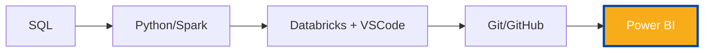
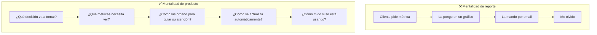
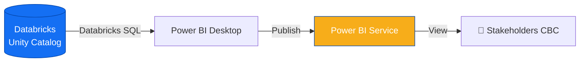

# Bienvenido al Curso de Power BI

**De DataFrames a decisiones de negocio.**

---

## El último eslabón

Llegaste al pilar final de Universidad Nexus. Durante los módulos anteriores construiste una base sólida:

Ya sabes consultar datos, transformarlos, organizarlos en proyectos profesionales y colaborar con tu equipo. Pero hay una última pregunta que define tu impacto real: **¿cómo convertir todo ese trabajo técnico en decisiones de negocio?**

Ahí entra Power BI.

---

## ¿Por qué Power BI importa tanto para un analista?

Un analista que solo hace DataFrames en Databricks es invisible para el negocio. Los stakeholders no ejecutan `display()`. No leen notebooks. No saben qué es Spark.

Lo que SÍ ven son dashboards.

| Sin Power BI | Con Power BI |
|---|---|
| 📄 Resultados en notebooks que nadie abre | 📊 Dashboards que la gerencia consulta cada día |
| 📧 Reportes en Excel que envías por email | 🔄 Reportes que se actualizan solos |
| 🗣️ "Luego te lo mando" | 🔗 "Está en el dashboard, ahí lo ves" |
| 👤 Trabajo invisible | ⭐ Trabajo visible e impactante |

**Power BI es el puente entre tu trabajo técnico y la gente que toma decisiones.**

---

## Lo que vas a aprender

Al finalizar este curso vas a poder:

- ✅ **Conectar Power BI con Databricks SQL** para traer datos en vivo
- ✅ **Construir modelos de datos correctos** con relaciones bien diseñadas
- ✅ **Escribir DAX** para crear métricas calculadas que el negocio necesita
- ✅ **Diseñar visualizaciones efectivas** (no solo bonitas)
- ✅ **Aplicar principios de UX** a dashboards ejecutivos
- ✅ **Publicar en Power BI Service** y compartir con stakeholders
- ✅ **Programar refrescos automáticos** para que los datos siempre estén frescos
- ✅ **Trabajar con la mentalidad de producto**, no de reporte desechable

---

## La filosofía del curso

> 💡 **Un dashboard no es un reporte bonito. Es una herramienta para tomar decisiones.**

Este curso no va a enseñarte "cómo hacer gráficos en Power BI". Eso lo aprende cualquiera con YouTube. Va a enseñarte algo más difícil: **cómo pensar como diseñador de productos de datos**.

La diferencia:

---

## ¿Qué herramientas vamos a usar?

CBC usa el stack estándar de Microsoft para Power BI:

| Herramienta | Para qué | Dónde vive |
|---|---|---|
| **Power BI Desktop** | Crear y editar reportes | Tu computadora |
| **Power BI Service** | Publicar, compartir, programar | Cloud de Microsoft |
| **Databricks SQL** | Fuente de datos principal | Databricks workspace |
| **DAX** | Lenguaje de fórmulas | Dentro de Power BI |

> ⚠️ **Importante:** Power BI Desktop solo funciona en Windows. Si usas Mac, vas a necesitar una máquina virtual, acceso remoto, o usar Power BI Service (versión web con limitaciones). Tu lead te puede orientar sobre la opción recomendada en CBC.

---

## La conexión con Databricks

El Power BI de CBC conecta directamente con Databricks SQL/Serverless. Eso significa:

**Todo lo que construiste en el Pilar 3 y 4 es la fuente de este pilar.** Las tablas de Unity Catalog que consultas con `spark.table('cbc_prod.ventas.transacciones')` son las mismas que vas a conectar a Power BI.

El ciclo se cierra.

---

## Estructura del curso

| Sección | Tema |
|---|---|
| 1 | Fundamentos de Power BI |
| 2 | Conectar con Databricks SQL |
| 3 | Modelado de datos |
| 4 | DAX — El lenguaje de las métricas |
| 5 | Visualizaciones efectivas |
| 6 | Diseño UX para dashboards |
| 7 | Publicación en Power BI Service |
| 8 | Repaso y evaluación final |

---

## Lo que NO vas a aprender aquí

Para ser claro sobre el alcance:

- ❌ Cada visualización avanzada de Power BI (hay cientos)
- ❌ Power Query / M en profundidad (lo usamos pero no como foco)
- ❌ Power BI Paginated Reports
- ❌ Administración de Power BI Service a nivel tenant
- ❌ Power BI Embedded / API

Lo que vas a aprender es **el núcleo que un analista de CBC necesita para construir dashboards profesionales de principio a fin**. Si después quieres profundizar en temas específicos, vas a tener la base para hacerlo solo.

---

## ¿Listo?

El módulo 6 va a cerrar tu transformación: de alguien que consulta datos a alguien que **construye productos de datos que impactan decisiones reales en CBC**.

Vamos.

---

*Universidad Nexus — Curso de Power BI para Analistas*
