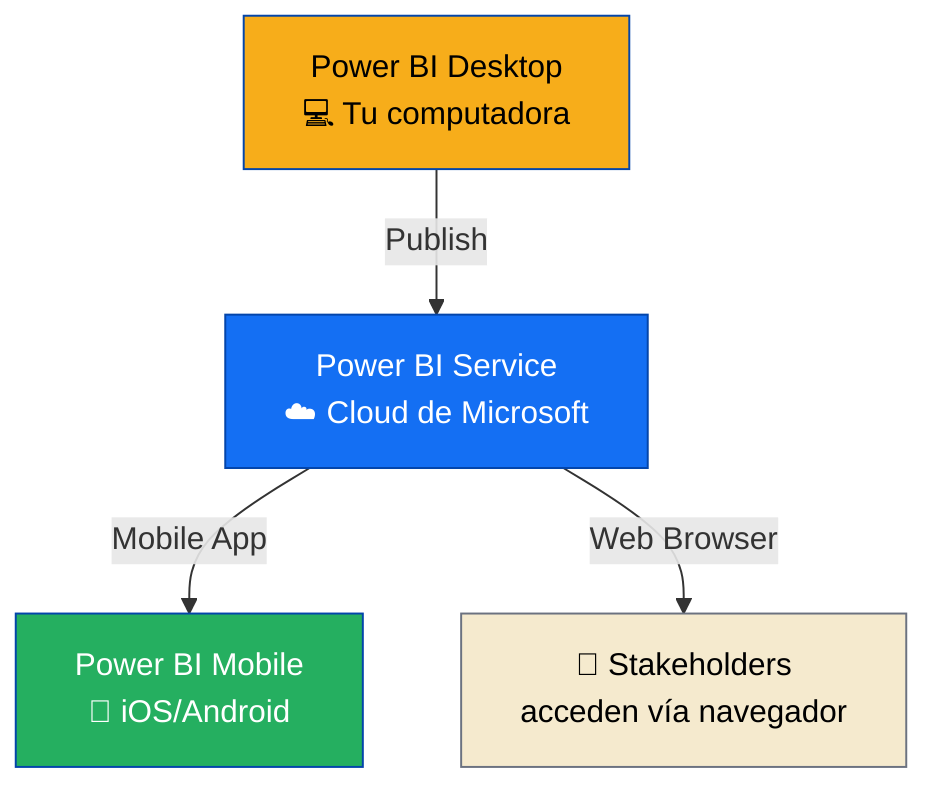
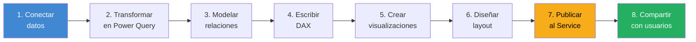
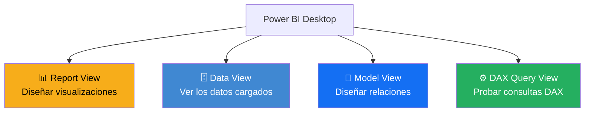
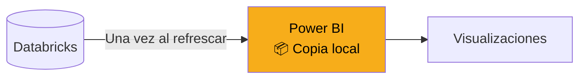
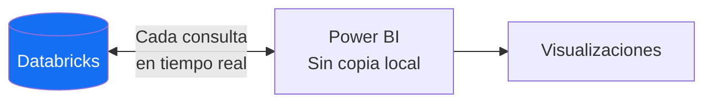

# ¿Qué es Power BI realmente?

Mucha gente piensa que Power BI es "un programa para hacer gráficos". No está mal, pero es como decir que Excel es "un programa para hacer tablas". Técnicamente cierto, prácticamente insuficiente.

Power BI es una **plataforma completa de Business Intelligence** con varias piezas que trabajan juntas.

---

## Las 3 piezas del ecosistema



### 1. Power BI Desktop

**Lo que es:** aplicación gratuita para Windows donde **creas y editas** reportes.

**Para qué sirve:**
- Conectarte a fuentes de datos (Databricks, SQL, Excel, APIs)
- Transformar datos con Power Query
- Diseñar el modelo de datos
- Escribir medidas DAX
- Crear las visualizaciones
- Diseñar el layout del reporte

> ⚠️ **Power BI Desktop solo funciona en Windows.** Si usas Mac, necesitas máquina virtual, Parallels, acceso remoto, o una alternativa. Pregunta a tu lead cuál usar en CBC.

### 2. Power BI Service

**Lo que es:** plataforma cloud de Microsoft donde **publicas, compartes y administras** los reportes.

**Para qué sirve:**
- Hospedar reportes para que otros los vean
- Programar refrescos automáticos de datos
- Configurar permisos (quién ve qué)
- Crear dashboards (distintos de reportes, ya veremos)
- Compartir con stakeholders del negocio
- Ver analíticas de uso

### 3. Power BI Mobile

**Lo que es:** app para iOS y Android que permite **consultar** reportes desde el celular.

**Para qué sirve:**
- Directores y gerentes viendo KPIs en reuniones
- Alertas cuando métricas superan umbrales
- Vista rápida de números sin abrir la laptop

> 💡 **Como analista, vas a usar principalmente Desktop y Service.** Mobile es la vista de tus stakeholders.

---

## El flujo de trabajo típico



Este flujo es lineal la primera vez, pero en la práctica iteras constantemente. Creas una visualización, te das cuenta que falta una métrica, vuelves a DAX, ajustas el modelo, regresas a la visualización. Es normal.

---

## Reporte vs Dashboard: la diferencia clave

Power BI usa dos términos que parecen sinónimos pero NO lo son:

| Reporte (Report) | Dashboard |
|---|---|
| 📄 Archivo .pbix completo | 🖼️ Vista única consolidada |
| Una o más páginas | Siempre 1 sola página |
| Interactivo, con filtros | Estático, solo vista |
| Se crea en Desktop | Se crea en el Service |
| Conecta a un modelo de datos | Muestra visuales de varios reportes |
| Para analistas y usuarios avanzados | Para ejecutivos y vista rápida |

**Analogía:**

```
Reporte  = Libro completo con capítulos, índice, análisis profundo
Dashboard = Portada del libro con los titulares más importantes
```

> 💡 **En este curso nos enfocamos en REPORTES.** Son lo que construyes como analista. Los dashboards son la vista ejecutiva que puedes armar después, y son más simples.

---

## Las áreas de Power BI Desktop

Cuando abres Power BI Desktop por primera vez, ves algo así:

[SCREENSHOT: Vista general de Power BI Desktop con áreas principales marcadas]

Las 4 vistas principales (íconos en la barra lateral izquierda):



### Report View (donde más tiempo vas a pasar)

Es donde diseñas las páginas del reporte: agregas visualizaciones, las posicionas, configuras filtros, aplicas formato.

### Data View

Te muestra las tablas cargadas como si fueran hojas de Excel. Útil para inspeccionar datos, entender qué columnas tienes, verificar tipos.

### Model View

Muestra las tablas como cajas con líneas que representan relaciones. Es donde conectas las tablas entre sí (por ejemplo, `ventas` con `productos` mediante `producto_id`).

### DAX Query View

Relativamente nueva. Permite escribir y probar consultas DAX como si fueran SQL. Útil para validar fórmulas antes de usarlas en medidas.

---

## Power Query: el paso previo oculto

Antes de que los datos lleguen a Power BI, pasan por **Power Query Editor**. Es una herramienta embebida en Power BI Desktop que permite transformar los datos antes de cargarlos al modelo.


Ejemplos de cosas que haces en Power Query:

- Renombrar columnas
- Cambiar tipos de datos
- Filtrar filas
- Eliminar columnas innecesarias
- Combinar tablas (merge, append)
- Parsear fechas
- Crear columnas calculadas simples

> 💡 **Regla práctica:** transforma lo más posible en la fuente (Databricks SQL) y lo mínimo en Power Query. Power Query es útil pero más lento y menos potente que Spark.

---

## Los 4 tipos de objetos en un modelo Power BI

Cuando trabajas en Power BI, estás manipulando 4 tipos de objetos principales:

| Objeto | Qué es | Ejemplo |
|---|---|---|
| **Tabla** | Una tabla de datos cargada al modelo | `ventas`, `productos`, `clientes` |
| **Columna** | Un campo dentro de una tabla | `monto`, `categoria`, `fecha` |
| **Medida** | Una fórmula DAX que calcula algo en el momento | `Total Ventas = SUM(ventas[monto])` |
| **Relación** | Conexión entre dos tablas | `ventas[producto_id]` ↔ `productos[id]` |

Vamos a trabajar con los 4 durante todo el curso.

---

## Import vs DirectQuery: la decisión más importante

Hay dos formas de traer datos de Databricks a Power BI, y la decisión afecta todo:

### Modo Import



Power BI **copia los datos** al archivo .pbix. Las visualizaciones usan esa copia local.

**✅ Ventajas:**
- Rápido para el usuario final
- Todas las funcionalidades de DAX disponibles
- No depende de conexión constante

**❌ Desventajas:**
- Los datos están "viejos" hasta el próximo refresco
- Limitado por tamaño del archivo (1 GB en workspace estándar)
- Requiere refrescos programados

### Modo DirectQuery



Power BI **no copia nada**. Cada vez que alguien interactúa con el reporte, se ejecuta una consulta contra Databricks en tiempo real.

**✅ Ventajas:**
- Datos siempre frescos
- Sin límite de tamaño (depende de Databricks)
- No requiere refrescos

**❌ Desventajas:**
- Más lento (depende de latencia de red y cluster)
- Algunas funcionalidades DAX no disponibles
- Carga constante sobre Databricks

### ¿Cuál usar?

| Situación | Recomendación |
|---|---|
| Datos históricos, < 1 GB | **Import** ✅ |
| Datos transaccionales en tiempo real | **DirectQuery** |
| Dashboard ejecutivo con pocas interacciones | **Import** ✅ |
| Tabla de millones de filas | **DirectQuery** |
| Primera vez haciendo un reporte | **Import** ✅ (más simple) |

> 💡 **Regla de oro en CBC:** empieza con **Import** a menos que haya una razón clara para usar DirectQuery. Import es más simple, más rápido y más robusto para la mayoría de casos.

---

## ¿Por qué Power BI y no otra cosa?

Existen otras herramientas: Tableau, Looker, Qlik, Metabase. ¿Por qué CBC usa Power BI?

| Razón | Explicación |
|---|---|
| 💰 **Costo** | Incluido en Microsoft 365, sin licencias extras por usuario básico |
| 🔗 **Ecosistema** | Integración nativa con Excel, Teams, SharePoint, Azure |
| 📊 **Adopción** | La mayoría de directores ya saben usar reportes de Microsoft |
| ⚡ **Rendimiento** | Motor VertiPaq muy rápido para datos en memoria |
| 🧠 **DAX** | Lenguaje potente para métricas complejas |
| 🔄 **Actualización constante** | Microsoft lanza mejoras mensuales |

No es la mejor herramienta para todo, pero es la más pragmática para un entorno Microsoft como CBC.

---

## 🎯 Validación de conceptos

Antes de avanzar, asegúrate de poder responder:

1. ¿Cuál es la diferencia entre Power BI Desktop y Power BI Service?
2. ¿Cuál es la diferencia entre un Reporte y un Dashboard?
3. ¿Qué hace Power Query?
4. ¿Cuáles son los 4 tipos de objetos en un modelo (tabla, columna, medida, relación)?
5. ¿Cuándo usarías Import y cuándo DirectQuery?

Si puedes responder estas 5 con confianza, estás listo para instalar y empezar.

---

*Universidad Nexus — Curso de Power BI para Analistas*
