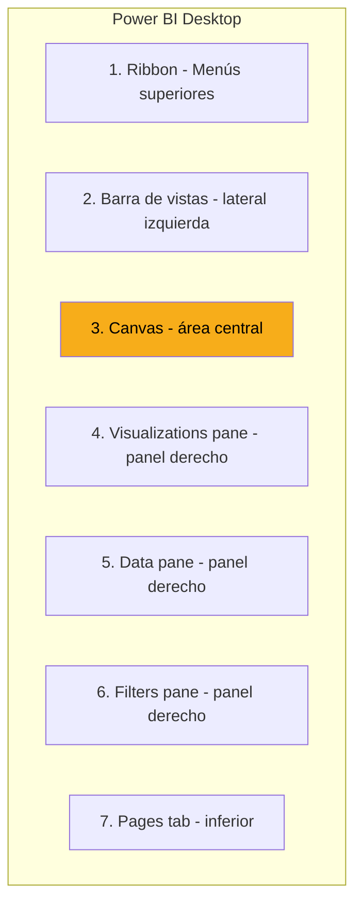

# Instalación y Primer Recorrido

Esta lección es 100% práctica. Vas a instalar Power BI Desktop, abrirlo por primera vez, y familiarizarte con la interfaz antes de cargar datos reales en la siguiente sección.

---

## Prerrequisitos

Antes de empezar, verifica que tienes:

| Requisito | Cómo verificarlo |
|---|---|
| ✅ Windows 10 u 11 | Configuración → Sistema → Acerca de |
| ✅ Cuenta corporativa de CBC activa | Login a Office 365 |
| ✅ Permisos para instalar software | Si no los tienes, pide ticket a IT |
| ✅ Al menos 1 GB libre en disco | Para la instalación y archivos .pbix |

> ⚠️ **Si usas Mac:** Power BI Desktop no existe para macOS. Opciones:
> 1. **Máquina virtual** (Parallels, VMware) con Windows
> 2. **Acceso remoto** a una máquina Windows de CBC
> 3. **Power BI Service** (versión web, con limitaciones importantes)
>
> Pregunta a tu lead cuál es la práctica estándar en tu equipo.

---

## Instalar Power BI Desktop

Tienes dos caminos para instalar. Ambos terminan con la misma aplicación.

### Opción A: Microsoft Store (recomendado)


**Ventajas de Microsoft Store:**

- ✅ Se actualiza automáticamente cada mes
- ✅ No necesitas permisos de admin
- ✅ Más simple

### Opción B: Descarga directa

1. Ir a [powerbi.microsoft.com/desktop](https://powerbi.microsoft.com/desktop)
2. Click en "Download free"
3. Descargar el instalador (64-bit, el estándar)
4. Ejecutar como administrador
5. Seguir el wizard de instalación

> 💡 **Recomendación honesta:** usa Microsoft Store si puedes. Las actualizaciones automáticas te ahorran dolores de cabeza. Microsoft lanza mejoras importantes cada mes.

---

## Primer inicio de sesión

La primera vez que abres Power BI Desktop:

[SCREENSHOT: Pantalla de bienvenida de Power BI Desktop]

1. Aparece una pantalla de bienvenida
2. Te pide iniciar sesión con cuenta Microsoft
3. Usa tu **cuenta corporativa de CBC** (la misma de Outlook)

> ⚠️ **Importante:** NO uses tu cuenta personal de Microsoft (Hotmail/Outlook.com). Power BI Service de CBC solo reconoce cuentas corporativas. Si usas la personal, no vas a poder publicar tus reportes después.

Una vez autenticado, puedes cerrar la ventana de bienvenida.

---

## Anatomía de la pantalla principal

Vamos a recorrer las zonas de Power BI Desktop. Ten la aplicación abierta mientras lees.

[SCREENSHOT: Pantalla principal con las zonas numeradas]



### 1. Ribbon (menús superiores)

Donde vive todo: Home, Insert, Modeling, View, Help. Funciona como cualquier producto de Microsoft.

### 2. Barra de vistas (lateral izquierda)

3 íconos principales (de arriba hacia abajo):

| Ícono | Vista | Para qué |
|---|---|---|
| 📊 | Report | Diseñar visualizaciones (default) |
| 🗄️ | Data | Ver las tablas cargadas |
| 🔗 | Model | Ver y editar relaciones entre tablas |

### 3. Canvas (el lienzo central)

Es donde diseñas cada página del reporte. Empieza vacío. Aquí arrastras y colocas las visualizaciones.

### 4. Visualizations pane

Panel derecho. Muestra todos los tipos de visualizaciones disponibles: gráfico de barras, línea, dona, tabla, matriz, mapa, KPI, etc.

### 5. Data pane

También en el panel derecho. Lista las tablas y campos cargados en el modelo. Para agregar un campo a una visualización, lo arrastras desde aquí.

### 6. Filters pane

Panel derecho. Permite aplicar filtros a nivel página, visual o reporte completo.

### 7. Pages tab

Tabs en la parte inferior. Un reporte puede tener múltiples páginas, como en Excel.

---

## Atajos esenciales del teclado

Aprende estos desde el día 1. Te van a ahorrar mucho tiempo:

| Atajo | Qué hace |
|---|---|
| `Ctrl + S` | Guardar |
| `Ctrl + Z` | Deshacer |
| `Ctrl + Y` | Rehacer |
| `Ctrl + N` | Nuevo reporte |
| `Ctrl + O` | Abrir reporte |
| `Ctrl + C` / `Ctrl + V` | Copiar/pegar visualizaciones |
| `Ctrl + D` | Duplicar visualización seleccionada |
| `F11` | Pantalla completa |
| `Ctrl + .` | Expandir todas las secciones de ribbon |

> 💡 **Guarda frecuentemente con Ctrl+S.** Power BI Desktop a veces crashea, especialmente con datasets grandes. Ahorra cada vez que termines un cambio importante.

---

## Configuraciones recomendadas

Antes de empezar a trabajar, vale la pena ajustar algunas opciones.

**Ir a:** `File → Options and settings → Options`

### Opciones importantes:

| Sección | Opción | Valor recomendado |
|---|---|---|
| **Global → Data Load** | Type detection | "Never detect column types" (para evitar inferencias malas) |
| **Global → Auto recovery** | Enable auto recovery | ✅ Activado, cada 5 minutos |
| **Global → Security** | Require user approval for new native database queries | ✅ Activado |
| **Current File → Auto date/time** | Auto date/time for new files | ❌ Desactivado |
| **Current File → Regional Settings** | Locale for import | English (United States) |

### ¿Por qué desactivar "Auto date/time"?

Cuando está activado, Power BI crea automáticamente jerarquías de fecha invisibles para cada columna de fecha. Suena útil pero:

- ❌ Infla el tamaño del modelo
- ❌ Crea confusión con tablas de calendario propias
- ❌ Dificulta el control sobre las métricas de tiempo

**Mejor:** tener una **tabla de calendario explícita** en tu modelo (lo vas a aprender en la sección de modelado).

---

## Tu primer archivo .pbix

Vamos a crear un archivo nuevo y guardarlo, aunque todavía no cargues datos. Solo para familiarizarte con el proceso.

### Paso 1: Nuevo reporte

`File → New` o `Ctrl + N`. Se abre un canvas en blanco.

### Paso 2: Renombrar la página

En la parte inferior, verás una pestaña llamada "Page 1". Doble click → renombrar a "Resumen".

### Paso 3: Agregar un text box

`Insert → Text box` (en el Ribbon). Dibuja un rectángulo en el canvas. Escribe "Mi primer reporte". Formatea con tamaño grande.

[SCREENSHOT: Canvas con un text box de bienvenida]

### Paso 4: Guardar

`File → Save As`. Elige una carpeta y nombra el archivo `mi_primer_reporte.pbix`.

> 💡 **Convención de naming:** usa snake_case o kebab-case. Nada de espacios en nombres de archivos. Ejemplos buenos: `ventas_mensuales_2024.pbix`, `dashboard-gerencial.pbix`.

### Paso 5: Verificar que guardó

Cierra Power BI Desktop. Abre la carpeta donde guardaste. Debes ver el archivo .pbix. Ábrelo con doble click para confirmar que carga correctamente.

**¡Listo!** Ya tienes Power BI Desktop instalado, configurado, y sabes cómo crear y guardar archivos.

---

## Archivos .pbix: qué son por debajo

Un archivo .pbix es en realidad un **archivo ZIP** con varios componentes adentro:

```
mi_reporte.pbix (es un ZIP)
├── DataModel       ← El modelo de datos (tablas, relaciones)
├── Report          ← Definición visual del reporte
├── Metadata        ← Info del archivo
└── Settings        ← Configuración
```

**Datos interesantes:**

- ✅ Si cambias la extensión a `.zip`, puedes abrirlo y ver su contenido
- ✅ Puedes versionarlo con Git, pero no es ideal (es binario)
- ⚠️ **No edites el contenido manualmente**. Vas a romper el archivo.

---

## Herramientas relacionadas que vale la pena conocer

Power BI tiene varias herramientas complementarias. No las vamos a usar todas, pero es bueno que sepas que existen:

| Herramienta | Para qué | En este curso |
|---|---|---|
| **Power BI Desktop** | Crear reportes | ✅ Uso intensivo |
| **Power BI Service** | Publicar y compartir | ✅ Sección 7 |
| **Power BI Mobile** | Ver reportes desde celular | ℹ️ Mencionamos |
| **DAX Studio** | Depurar y analizar DAX avanzado | ℹ️ Mencionamos |
| **Tabular Editor** | Editar modelos DAX de forma avanzada | ❌ No cubierto |
| **ALM Toolkit** | Comparar y mergear modelos | ❌ No cubierto |

> 💡 **DAX Studio y Tabular Editor son herramientas externas gratuitas muy usadas por desarrolladores avanzados de Power BI.** Cuando quieras crecer más allá de este curso, vale la pena investigarlas.

---

## 🎯 Tareas

**Tarea 1:** Instalar Power BI Desktop desde Microsoft Store (o descarga directa si no funciona Store).

**Tarea 2:** Iniciar sesión con tu cuenta corporativa de CBC.

**Tarea 3:** Aplicar las configuraciones recomendadas en `Options`.

**Tarea 4:** Crear un archivo nuevo, renombrar la página, agregar un text box, guardar como `mi_primer_reporte.pbix`.

**Tarea 5:** Cerrar y volver a abrir el archivo para confirmar que persiste.

**Tarea 6:** Recorrer las 3 vistas principales (Report, Data, Model) con la barra lateral. Observa cómo cambia la interfaz.

**Tarea 7:** Explorar el Ribbon. Revisa los menús Home, Insert, Modeling, View. No necesitas entender todo, solo familiarizarte.

---

*Universidad Nexus — Curso de Power BI para Analistas*
