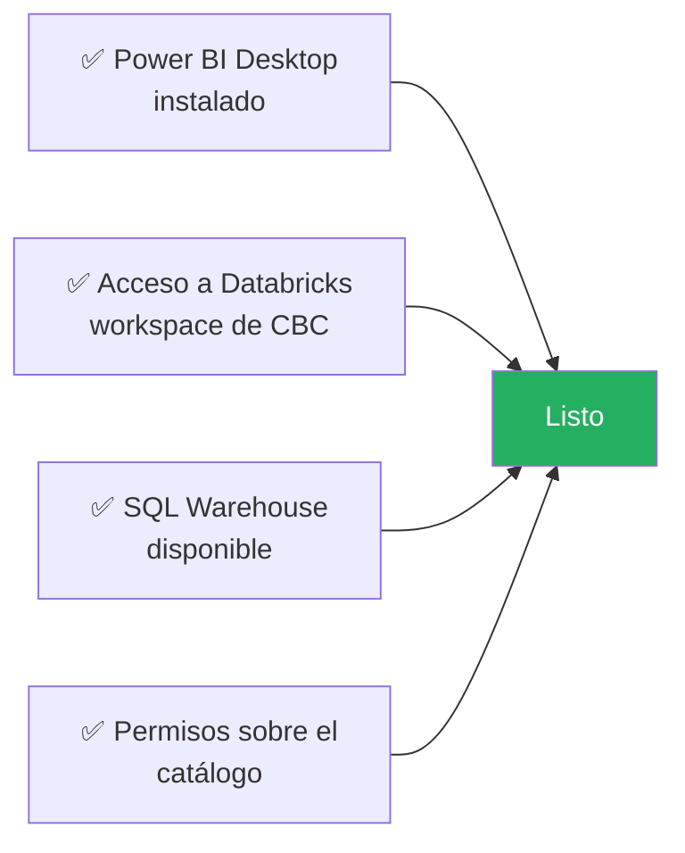
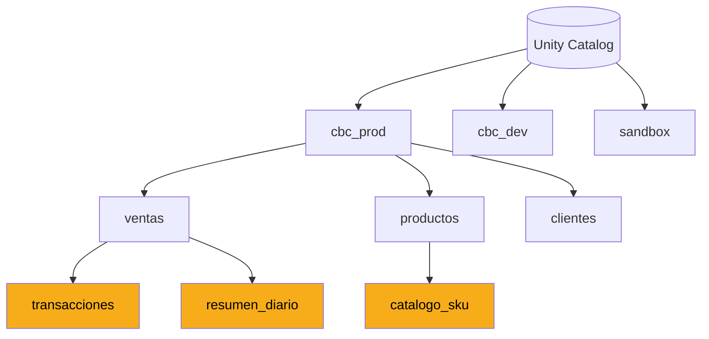
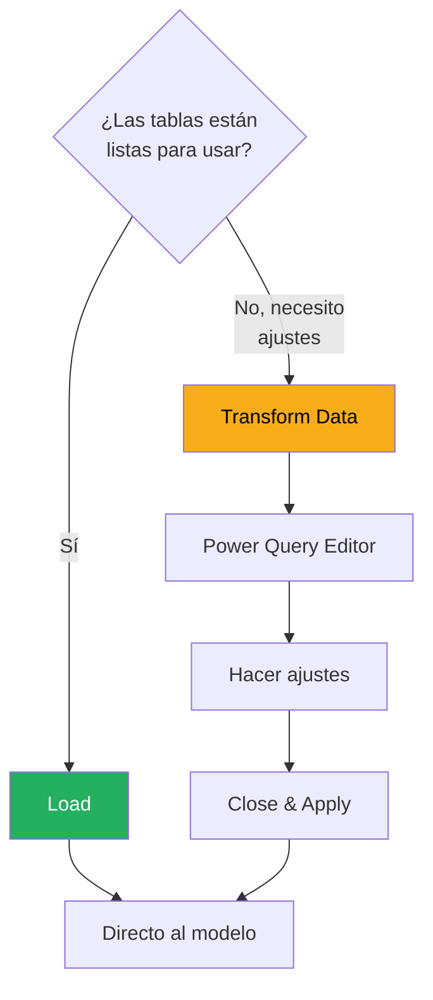

# Configurar la Conexión

Vamos a conectar Power BI Desktop con Databricks SQL de CBC paso a paso. Esta es la configuración que vas a usar en prácticamente todos los reportes que hagas.

---

## Lo que necesitas antes de empezar



### Los 4 requisitos:

| Requisito | Cómo obtenerlo |
|---|---|
| **Power BI Desktop** | Sección anterior ✅ |
| **Acceso al workspace de Databricks CBC** | Ya lo tienes del Pilar 4 |
| **Un SQL Warehouse activo** | Tu lead o plataforma te indica cuál usar |
| **Permisos `SELECT` sobre el catálogo** | Si ya haces consultas en Databricks, los tienes |

> ⚠️ **SQL Warehouse vs Cluster:** en Databricks hay dos cosas distintas. Los **clusters** son para ejecutar notebooks con Spark. Los **SQL Warehouses** son específicos para consultas SQL y son a lo que se conecta Power BI. Son cosas diferentes. Confirma con tu lead cuál usar.

---

## Obtener los datos de conexión desde Databricks

Antes de ir a Power BI, necesitas dos datos específicos del SQL Warehouse de CBC.

### Paso 1: Ir al workspace de Databricks

1. Abrir Databricks en el navegador
2. En el menú lateral izquierdo, click en **SQL Warehouses**

[SCREENSHOT: Vista de SQL Warehouses en Databricks]

### Paso 2: Elegir un warehouse

Verás una lista de warehouses disponibles. Cada uno tiene un estado:

| Estado | Qué significa |
|---|---|
| 🟢 **Running** | Listo para usar |
| 🟡 **Starting** | Arrancando, espera un momento |
| 🔵 **Stopped** | Apagado, arrancalo si tienes permisos |

Click en el que quieras usar.

> 💡 **Buena práctica:** pregunta a tu lead cuál warehouse usar. En CBC probablemente hay uno dedicado para Power BI (ej: `pbi-warehouse`) para no competir con workloads interactivos.

### Paso 3: Copiar los datos de conexión

Dentro del warehouse, click en la pestaña **Connection details**.

[SCREENSHOT: Pestaña Connection details con los campos a copiar]

Necesitas copiar **dos valores**:

| Campo | Ejemplo | Para qué |
|---|---|---|
| **Server hostname** | `adb-1234567890.12.azuredatabricks.net` | El servidor al que te conectas |
| **HTTP path** | `/sql/1.0/warehouses/abc123def456` | La ruta específica del warehouse |

Copia ambos en un lugar seguro temporal (un archivo de texto, una nota). Los vas a pegar en Power BI en el siguiente paso.

> ⚠️ **NO guardes estos datos en lugares públicos.** Son información de infraestructura de CBC. Trátalos con cuidado.

---

## Conectar desde Power BI Desktop

Ahora la parte divertida: conectar Power BI al warehouse.

### Paso 1: Abrir Power BI Desktop

Abre un archivo nuevo o uno existente.

### Paso 2: Get Data

En el Ribbon: `Home → Get data → More...`

[SCREENSHOT: Menú Get Data mostrando opciones]

### Paso 3: Buscar el conector de Databricks

En la ventana que se abre, escribe "Databricks" en el buscador.

Verás varios resultados. El que necesitas es:

> 🎯 **Azure Databricks** (asegúrate que sea el oficial de Microsoft, no terceros)

Selecciónalo y click en **Connect**.

[SCREENSHOT: Ventana del conector de Azure Databricks]

### Paso 4: Ingresar los datos de conexión

Se abre un formulario. Llena los campos:

| Campo | Qué poner |
|---|---|
| **Server hostname** | Lo que copiaste del warehouse |
| **HTTP path** | Lo que copiaste del warehouse |
| **Data Connectivity mode** | `Import` (para empezar) |

> 💡 **Empieza siempre con Import.** Es más simple, más rápido, y cubre el 90% de los casos. DirectQuery es una optimización que verás después.

Click en **OK**.

### Paso 5: Autenticación

Power BI te pregunta cómo autenticarte. Opciones:

| Método | Cuándo usar |
|---|---|
| **Azure Active Directory** ✅ | Casi siempre. Usa tu cuenta corporativa de CBC |
| **Personal Access Token** | Solo si AAD no funciona |
| **Username/Password** | No recomendado |

Selecciona **Azure Active Directory** → click en **Sign in**.

Se abre el navegador. Inicia sesión con tu cuenta corporativa. Cuando termine, vuelve a Power BI Desktop.

Click en **Connect**.

---

## Navegador de datos

Power BI se conecta a Databricks y te muestra el **Navigator**: un árbol con todos los catálogos, schemas y tablas a los que tienes acceso.

[SCREENSHOT: Navegador mostrando jerarquía de catálogo → schema → tablas]



### Navegar la jerarquía

Recuerda la sintaxis de tres niveles de Unity Catalog:

```
catalog.schema.table
```

Que en el Navigator se ve así:

```
📁 cbc_prod
  └── 📁 ventas
      ├── 📊 transacciones
      ├── 📊 resumen_diario
      └── 📊 devoluciones
  └── 📁 productos
      └── 📊 catalogo_sku
```

Expande las carpetas hasta encontrar las tablas que necesitas.

### Seleccionar tablas

Marca el checkbox junto a cada tabla que quieras cargar al modelo.

[SCREENSHOT: Tablas seleccionadas con preview a la derecha]

> 💡 **Regla crítica:** solo selecciona las tablas que REALMENTE vas a usar. Cada tabla que traes ocupa memoria en el modelo. No traigas "por si acaso".

### Preview de datos

Al hacer click en una tabla (sin marcar el checkbox), ves un preview de los datos a la derecha. Úsalo para verificar que es la tabla correcta antes de cargarla.

---

## Load vs Transform Data

Una vez seleccionadas las tablas, tienes dos botones en la parte inferior:

| Botón | Qué hace |
|---|---|
| **Load** | Carga las tablas directamente al modelo |
| **Transform Data** | Abre Power Query para transformaciones antes de cargar |

### ¿Cuál usar?



**Recomendación:**

- ✅ Si confías en tus tablas de Databricks (y deberías, porque tú las creaste), usa **Load**
- ✅ Si necesitas renombrar columnas, filtrar, cambiar tipos, usa **Transform Data**

> 💡 **Principio clave:** transforma lo máximo posible en Databricks SQL (o en Spark), y lo mínimo en Power Query. Databricks es mucho más potente y rápido.

---

## Verificar la conexión

Después de hacer Load, Power BI importa las tablas. Esto puede tomar entre segundos y minutos dependiendo del tamaño.

Cuando termine:

### 1. Ver las tablas cargadas

Click en la vista **Data** (ícono de la tabla en la barra lateral). Verás las tablas listadas en el Data pane a la derecha.

[SCREENSHOT: Data view mostrando tablas cargadas]

### 2. Inspeccionar columnas

Click en cualquier tabla para ver sus columnas. Verifica:

- ✅ ¿Las columnas tienen los tipos correctos?
- ✅ ¿Los nombres son legibles?
- ✅ ¿Los datos se ven como esperabas?

### 3. Ver las relaciones (Model view)

Click en la vista **Model**. Verás las tablas como cajas. Si Power BI detectó relaciones automáticamente, verás líneas conectándolas.

[SCREENSHOT: Model view con tablas y relaciones automáticas]

> ⚠️ **Las relaciones automáticas de Power BI son adivinanzas.** A veces acierta, a veces no. En la siguiente sección vas a aprender a revisarlas y corregirlas manualmente.

---

## Refrescar los datos

Una vez cargadas las tablas, los datos son una "foto" del momento en que las trajiste. Para actualizarlas:

`Home → Refresh`

Power BI vuelve a consultar Databricks y actualiza los datos.

[SCREENSHOT: Botón Refresh en el Ribbon]

> 💡 **En Power BI Desktop** refrescas manualmente. **En Power BI Service** puedes programar refrescos automáticos (sección 7).

---

## Errores comunes de conexión

### ❌ "Unable to connect to the remote server"

**Causas:**
- El SQL Warehouse está apagado
- Problemas de red/VPN corporativa
- Datos de conexión mal copiados

**Solución:**
1. Verificar en Databricks que el warehouse está Running
2. Verificar VPN si es necesaria
3. Re-copiar Server hostname y HTTP path

### ❌ "Authentication failed"

**Causas:**
- Sesión de Azure AD expiró
- No tienes permisos sobre el warehouse
- Usaste cuenta personal en vez de corporativa

**Solución:**
1. `File → Options → Data source settings → Global permissions`
2. Selecciona la conexión de Databricks → Edit permissions → Clear permissions
3. Vuelve a conectar con Azure AD

### ❌ "Permission denied on table"

**Causas:**
- Tu usuario no tiene `SELECT` sobre la tabla
- La tabla está en un schema al que no tienes acceso

**Solución:**
Habla con tu lead. En CBC los permisos de Unity Catalog se administran centralizadamente.

### ❌ El refresh tarda muchísimo

**Causas:**
- La tabla es muy grande
- Estás cargando columnas innecesarias
- Transformaciones pesadas en Power Query

**Soluciones:**
1. Filtrar en la fuente (Databricks SQL) antes de cargar
2. Eliminar columnas que no uses del modelo
3. Mover transformaciones de Power Query a Databricks

---

## Buenas prácticas desde el día 1

| ✅ Hazlo | ❌ Evítalo |
|---|---|
| Filtrar filas innecesarias en la fuente | Cargar tablas completas "por si acaso" |
| Seleccionar solo columnas necesarias | Traer todas las columnas del schema |
| Renombrar columnas en Power Query si es necesario | Dejar nombres técnicos crípticos |
| Empezar con Import mode | Usar DirectQuery sin razón clara |
| Guardar el .pbix frecuentemente | Trabajar horas sin guardar |
| Probar los datos antes de modelar | Asumir que todo está bien y modelar a ciegas |

---

## 🎯 Tareas

**Tarea 1:** Obtener del SQL Warehouse de CBC: Server hostname y HTTP path. Pide a tu lead cuál usar.

**Tarea 2:** En Power BI Desktop, conectar con Azure Databricks usando los datos del paso 1.

**Tarea 3:** Autenticar con Azure Active Directory (cuenta corporativa CBC).

**Tarea 4:** Navegar el catálogo de Unity Catalog hasta encontrar al menos 2 tablas relevantes para un análisis.

**Tarea 5:** Seleccionar las tablas y hacer Load (sin Transform).

**Tarea 6:** Verificar en Data view que las tablas cargaron correctamente.

**Tarea 7:** Ejecutar un Refresh y confirmar que funciona.

**Tarea 8:** Guardar como `conexion_databricks.pbix` para usar en las siguientes lecciones.

---

*Universidad Nexus — Curso de Power BI para Analistas*
