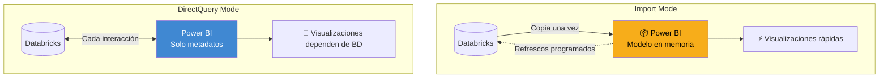
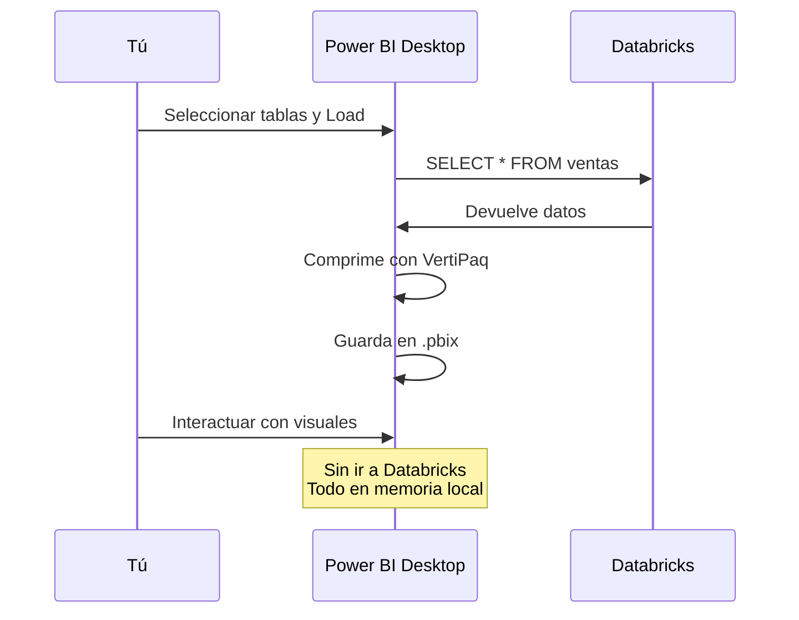
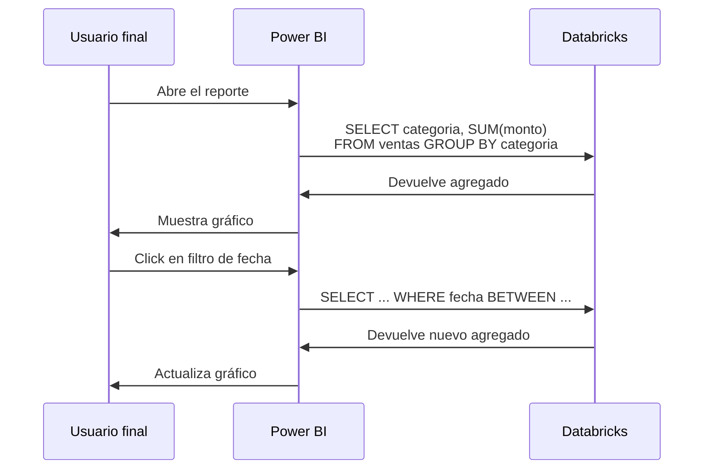
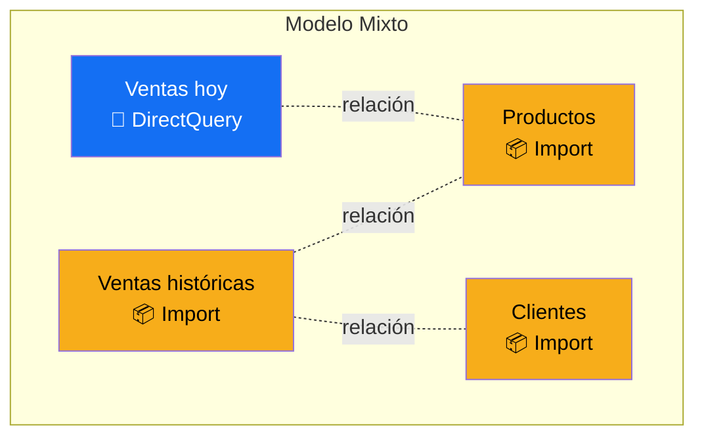
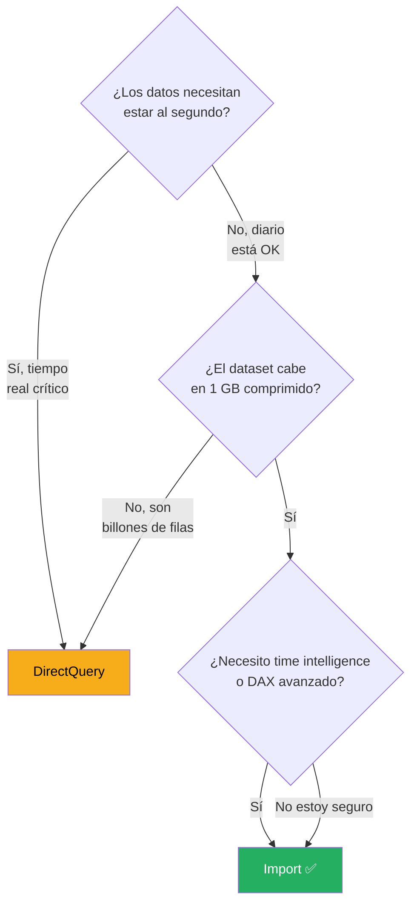

# Import vs DirectQuery — La Decisión Crítica

Esta es probablemente la decisión técnica más importante que vas a tomar al crear un reporte en Power BI. Afecta la velocidad, el costo, la complejidad y el mantenimiento. Tómatela en serio.

---

## El trade-off en una imagen

---

## Import en profundidad

### ¿Cómo funciona internamente?

Cuando usas Import, Power BI hace esto:

Los datos se almacenan en un motor interno llamado **VertiPaq**, que comprime y organiza los datos para consultas rápidas en memoria.

### Ventajas de Import

| Ventaja | Detalle |
|---|---|
| ⚡ **Velocidad** | Consultas en milisegundos porque todo está en RAM |
| 🎨 **DAX completo** | Todas las funciones DAX disponibles |
| 🔒 **Independencia** | El reporte funciona aunque Databricks esté caído |
| 📊 **Compresión** | VertiPaq comprime hasta 10x el tamaño original |
| 💰 **Costo** | Databricks solo se consulta durante refrescos |

### Desventajas de Import

| Desventaja | Detalle |
|---|---|
| ⏱️ **Datos viejos** | Los datos son del último refresco, no en tiempo real |
| 📏 **Tamaño limitado** | 1 GB por modelo en workspace estándar, 10 GB en Premium |
| 🔄 **Refrescos necesarios** | Hay que programarlos y monitorearlos |
| 🧠 **Consume memoria** | El .pbix puede crecer mucho con tablas grandes |

### Cuándo usar Import ✅

- ✅ Datos históricos que no cambian mucho durante el día
- ✅ Modelos pequeños a medianos (< 1 GB comprimido)
- ✅ Reportes ejecutivos con pocas interacciones pero muchas vistas
- ✅ Primera vez haciendo un reporte (siempre)
- ✅ Cuando necesitas funciones DAX avanzadas (time intelligence, calculate complejas)

---

## DirectQuery en profundidad

### ¿Cómo funciona internamente?

DirectQuery no copia datos. En cambio, cada vez que alguien interactúa con un visual, Power BI genera una consulta SQL y la envía a Databricks:

Cada interacción del usuario = una consulta nueva a Databricks.

### Ventajas de DirectQuery

| Ventaja | Detalle |
|---|---|
| 🔄 **Datos siempre frescos** | Lo que ves es el último dato en Databricks |
| 📊 **Sin límite de tamaño** | El reporte puede consultar billones de filas |
| 🚫 **Sin refrescos** | No hay que programar nada |
| 🔒 **Seguridad a nivel fuente** | Los permisos de Unity Catalog aplican directamente |

### Desventajas de DirectQuery

| Desventaja | Detalle |
|---|---|
| 🐢 **Más lento** | Cada click dispara una consulta a la red |
| 🚧 **DAX limitado** | Algunas funciones no están disponibles |
| 💸 **Carga constante** | Databricks se consulta todo el tiempo |
| 🔧 **Más complejo** | Optimizar requiere entender SQL que genera Power BI |
| ⚠️ **Dependiente** | Si Databricks está caído, el reporte no funciona |

### Cuándo usar DirectQuery

- 🔄 Datos transaccionales en tiempo real (ej: monitor de operaciones)
- 📏 Tablas con cientos de millones o miles de millones de filas
- 🔒 Requisitos de seguridad estrictos (no se puede tener copia local)
- 📊 Dashboards operacionales que deben mostrar el último segundo

---

## Modo mixto: Composite Models

Power BI permite algo más sofisticado: **Composite Models**, donde puedes mezclar tablas en Import y DirectQuery en el mismo reporte.

**Caso típico:** 
- Datos históricos en Import (5 años de ventas, no cambian)
- Datos del día actual en DirectQuery (se actualizan cada minuto)

> 💡 **Los Composite Models son potentes pero complejos.** No los uses hasta que domines Import puro. Los menciono para que sepas que existen.

---

## Comparación directa

| Criterio | Import | DirectQuery |
|---|---|---|
| **Velocidad del usuario** | ⚡⚡⚡⚡⚡ | ⚡⚡ |
| **Frescura de datos** | ⭐⭐ | ⭐⭐⭐⭐⭐ |
| **Tamaño máximo** | 1-10 GB | Ilimitado |
| **Funciones DAX disponibles** | 100% | ~70% |
| **Complejidad de setup** | Baja | Media-Alta |
| **Carga sobre Databricks** | Solo en refrescos | Constante |
| **Funciona offline** | ✅ Sí | ❌ No |
| **Recomendado para empezar** | ✅ | ❌ |

---

## La decisión en 3 preguntas

Cuando vas a crear un reporte nuevo, hazte estas 3 preguntas:

### Pregunta 1: ¿Los datos necesitan estar al segundo?

- **Sí** → DirectQuery
- **No, con refresco diario está bien** → Continúa

### Pregunta 2: ¿El dataset cabe en 1 GB comprimido?

(Regla práctica: 1 GB comprimido ≈ 10-50 millones de filas promedio)

- **No, son billones de filas** → DirectQuery
- **Sí** → Continúa

### Pregunta 3: ¿Necesitas DAX avanzado?

- **Sí** → Import ✅
- **No estoy seguro** → Import ✅ (por defecto)

---

## Casos reales de CBC

### Caso 1: Dashboard de ventas mensuales por categoría

| Característica | Valor |
|---|---|
| Frecuencia de actualización | Diaria |
| Tamaño | 2 años × 12 meses × 20 categorías = ~480 filas |
| Audiencia | Gerentes comerciales |

**Decisión:** 🟢 **Import** (sin dudarlo)

### Caso 2: Monitor de operaciones de bodega

| Característica | Valor |
|---|---|
| Frecuencia de actualización | Cada 5 minutos |
| Tamaño | 500 filas actualizándose constantemente |
| Audiencia | Operadores de bodega en vivo |

**Decisión:** 🔵 **DirectQuery** (la frescura es crítica)

### Caso 3: Análisis histórico de 5 años de transacciones

| Característica | Valor |
|---|---|
| Frecuencia de actualización | Mensual |
| Tamaño | 250 millones de filas |
| Audiencia | Analistas estratégicos |

**Decisión:** 🟡 **Import con filtros agresivos** o **Composite Model**

Estrategia: importar solo las agregaciones útiles (por mes, por categoría, por región) y mantener el detalle en Databricks vía DirectQuery para análisis ad-hoc.

---

## Cambiar el modo después

Si empezaste con un modo y quieres cambiar al otro:

### De Import a DirectQuery

⚠️ **Complicado.** Requiere rehacer la conexión. Las tablas tienen que soportar DirectQuery (no todos los orígenes sí).

### De DirectQuery a Import

✅ **Más fácil.** En `Home → Transform data → Data source settings`, puedes cambiar el modo de una tabla individual.

> 💡 **Por esto empezamos con Import:** cambiar después es posible y rara vez doloroso.

---

## Errores clásicos al elegir modo

### ❌ "Uso DirectQuery porque suena más profesional"

**Realidad:** empieza con Import. Es más simple, más rápido y más robusto. DirectQuery es una optimización, no un default.

### ❌ "Import es para principiantes, DirectQuery es avanzado"

**Realidad:** Import requiere saber modelar, escribir DAX y optimizar. DirectQuery requiere saber SQL, optimización de queries y Databricks. Ambos son avanzados a su manera.

### ❌ "Con DirectQuery no necesito preocuparme por el tamaño"

**Realidad:** sí te preocupas, porque cada visualización lenta es una consulta lenta a Databricks. Y eso cuesta dinero.

### ❌ "Import es 'viejo'"

**Realidad:** el 80% de los reportes productivos del mundo usan Import. No tiene nada de viejo. Es el default por buenas razones.

---

## 🎯 Reflexión

Antes de avanzar, reflexiona sobre estos escenarios y decide qué modo usarías:

1. **Reporte de ventas mensuales para gerencia**, actualizado cada noche, con 3 años de historia (~100K filas).
2. **Monitor de inventario en tiempo real** para logística, con 50M de SKUs actualizándose.
3. **Análisis de churn de clientes** con 2 años de comportamiento, 500K clientes.
4. **Dashboard de finanzas** con drill-down hasta transacción individual, 1M de transacciones al mes.

Ahora compara con estas respuestas:

1. Import ✅
2. DirectQuery
3. Import ✅
4. Import ✅ (con agregaciones bien hechas)

Si dudaste, no te preocupes. La experiencia de este curso te va a dar criterio.

---

## 🎯 Tareas

**Tarea 1:** Lista 3 reportes que puedas tener que crear en CBC en los próximos meses. Para cada uno, aplica las 3 preguntas de decisión y define qué modo usarías.

**Tarea 2:** En tu `conexion_databricks.pbix`, verifica que estás usando Import mode. Si no, reemplaza la conexión.

**Tarea 3:** Investiga con tu lead si tu equipo tiene convenciones sobre cuándo usar Import vs DirectQuery en CBC.

**Tarea 4:** Revisa un reporte existente de CBC (pídelo a tu lead). Abre el archivo en Power BI Desktop. En `Transform data`, mira qué modo usan las tablas.

---

*Universidad Nexus — Curso de Power BI para Analistas*
