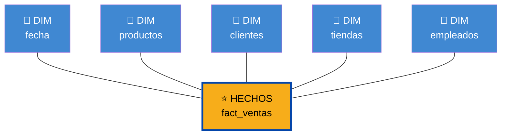
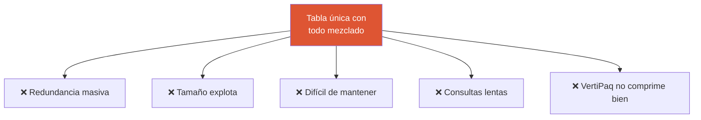
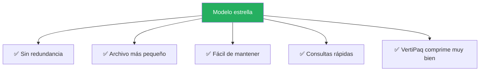
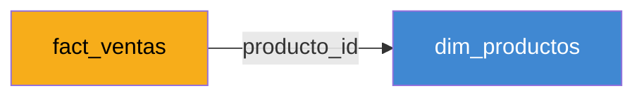
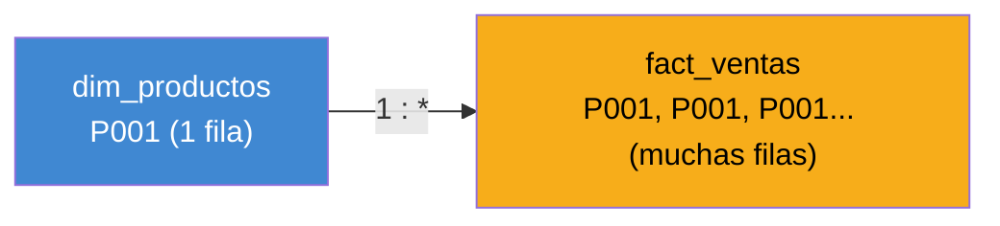
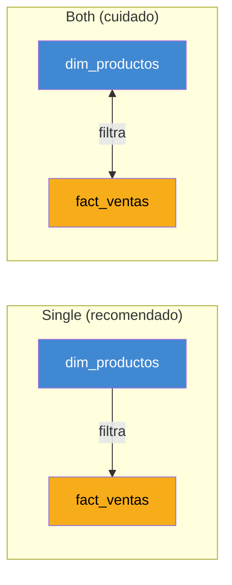
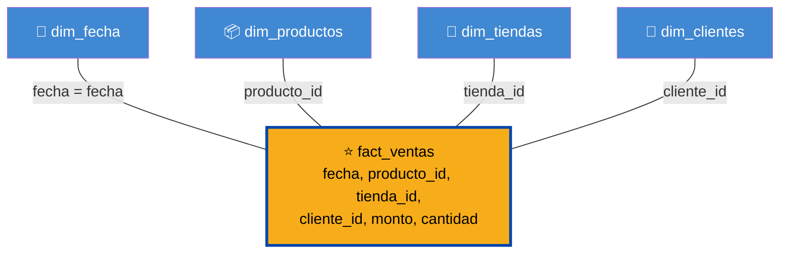
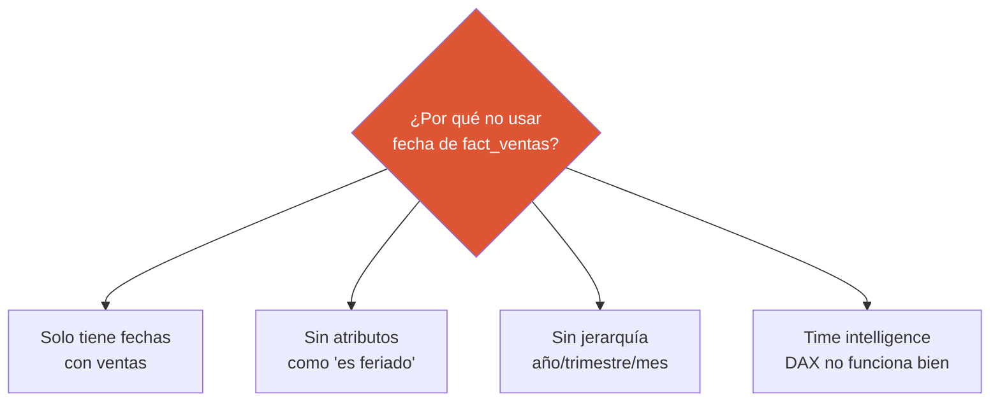

# El Modelo Estrella

Power BI funciona mejor cuando tu modelo de datos sigue una estructura específica: el **modelo estrella** (star schema). No es capricho. Es porque el motor VertiPaq fue diseñado específicamente para ese tipo de modelo.

Esta lección te enseña qué es el modelo estrella, por qué importa, y cómo aplicarlo a los datos de CBC.

---

## La forma de una estrella



En el centro: **una tabla de hechos**. Alrededor: **tablas de dimensiones**. Cada dimensión conectada al centro con una sola relación. Se llama "estrella" porque visualmente se parece a una.

---

## Los 2 tipos de tablas

Un modelo estrella tiene solo 2 tipos de tablas:

### 1. Tabla de hechos (Fact table)

**Qué contiene:** los eventos o transacciones que quieres medir. Son los "qué pasó".

**Características:**
- Muchas filas (millones)
- Pocas columnas
- Columnas numéricas (los números que mides)
- Columnas de ID para conectar con dimensiones
- Sin descripciones de texto

**Ejemplo: `fact_ventas`**

| fecha_id | producto_id | cliente_id | tienda_id | monto | cantidad |
|---|---|---|---|---|---|
| 20240101 | P001 | C5421 | T12 | 1250.00 | 3 |
| 20240101 | P234 | C5421 | T12 | 580.00 | 1 |
| 20240102 | P001 | C8932 | T07 | 625.00 | 1 |
| ... | ... | ... | ... | ... | ... |

> 💡 **La tabla de hechos contiene los NÚMEROS que te interesan, y IDs para conectarlos con la información descriptiva.**

### 2. Tablas de dimensión (Dim tables)

**Qué contienen:** las descripciones, categorías, jerarquías. Son el "cómo se llama, cómo se clasifica".

**Características:**
- Pocas filas (cientos o miles)
- Muchas columnas
- Columnas descriptivas (textos, categorías, fechas)
- Una columna de ID (clave primaria)

**Ejemplo: `dim_productos`**

| producto_id | nombre | categoria | marca | presentacion | precio_sugerido |
|---|---|---|---|---|---|
| P001 | Pepsi 600ml | Bebidas | Pepsi | Botella | 1500 |
| P002 | Lipton Té 1.5L | Bebidas | Lipton | Botella | 3200 |
| P234 | Gatorade 500ml | Hidratantes | Gatorade | Botella | 1400 |
| ... | ... | ... | ... | ... | ... |

**Ejemplo: `dim_tiendas`**

| tienda_id | nombre | ciudad | pais | region | formato |
|---|---|---|---|---|---|
| T07 | Super San Salvador Centro | San Salvador | El Salvador | Metropolitana | Supermercado |
| T12 | Tegu Mall Norte | Tegucigalpa | Honduras | Norte | Mall |
| T45 | Managua Express 3 | Managua | Nicaragua | Capital | Conveniencia |
| ... | ... | ... | ... | ... | ... |

---

## ¿Por qué modelo estrella y no "una sola tabla grande"?

Muchos analistas al empezar piensan: "¿por qué separar? Puedo tener todo en una sola tabla con columnas como `producto_nombre`, `producto_categoria`, `tienda_ciudad`, etc."

### La tabla única ("tabla plana")

```
fact_ventas_completa:
fecha | producto_id | producto_nombre | producto_categoria | producto_marca | 
tienda_id | tienda_nombre | tienda_ciudad | tienda_pais | cliente_id | ... | monto
```

### Problemas de la tabla única



| Problema | Explicación |
|---|---|
| 🔄 **Redundancia** | "Pepsi 600ml" se repite millones de veces |
| 📦 **Tamaño** | El archivo puede crecer 5-10x innecesariamente |
| 🐢 **Velocidad** | VertiPaq comprime mal columnas con mucha variedad |
| 🔧 **Mantenimiento** | Si cambia el nombre de un producto, hay que actualizar millones de filas |
| 🎯 **Reutilización** | No puedes reutilizar las dimensiones en otros reportes |

### Modelo estrella resuelve todos los problemas



---

## Los IDs son la clave

En un modelo estrella, las tablas se conectan mediante **IDs** (también llamados claves o keys).



En `fact_ventas` solo tienes `producto_id = P001`. Cuando Power BI necesita saber el nombre del producto, busca ese ID en `dim_productos` y trae `"Pepsi 600ml"`.

**Ventaja:** `fact_ventas` solo guarda un código corto (P001), no el nombre completo. Millones de veces. Ahorro enorme.

---

## Cardinalidad de relaciones

Cuando conectas dos tablas, la relación tiene una **cardinalidad**. Es cuántas filas de un lado se relacionan con cuántas del otro.

### One-to-Many (1:*)

**La más común en modelos estrella.** Una fila de la dimensión se relaciona con muchas de la tabla de hechos.



**Ejemplo:** un producto (P001) aparece en miles de ventas. La dimensión tiene 1 fila, la tabla de hechos tiene muchas.

### Many-to-Many (*:*)

Ambas tablas tienen muchas filas relacionadas con muchas.

> ⚠️ **Evita many-to-many en lo posible.** Power BI las soporta pero son más complejas, más lentas, y causan problemas de cálculo.

### One-to-One (1:1)

Una fila de cada lado. Raro en la práctica.

### Dirección del filtro

Cada relación también tiene una **dirección de filtro**:

- **Single** (unidireccional): el filtro solo viaja de la dimensión a la fact table. ✅ Recomendado
- **Both** (bidireccional): el filtro viaja en ambas direcciones. ⚠️ Usa con cuidado



> 💡 **Regla práctica:** 95% de las relaciones en un modelo estrella son **one-to-many con filtro single**. Solo usa otras opciones cuando tengas una razón clara.

---

## Crear relaciones en Power BI

Power BI intenta detectar relaciones automáticamente al cargar datos. A veces acierta, a veces no. **Siempre revisa manualmente.**

### Paso 1: Ir a Model view

Click en el ícono de Model view en la barra lateral izquierda.

[SCREENSHOT: Model view con tablas flotando]

### Paso 2: Ver las relaciones existentes

Verás las tablas como cajas. Si hay relaciones, aparecen como líneas entre las cajas.

- Línea sólida = relación activa
- Línea punteada = relación inactiva
- Números en los extremos = cardinalidad (1 o *)

[SCREENSHOT: Relaciones visualizadas con indicadores de cardinalidad]

### Paso 3: Crear una relación manualmente

Si falta una relación:

1. Click sobre la columna ID de una tabla (ej: `producto_id` en `fact_ventas`)
2. Arrastra hacia la columna equivalente en la otra tabla (ej: `producto_id` en `dim_productos`)
3. Suelta

Power BI crea la relación y te muestra un diálogo para confirmar la cardinalidad.

### Paso 4: Editar una relación

Doble click sobre la línea de una relación existente. Se abre el editor:

[SCREENSHOT: Diálogo de edición de relación con opciones]

Verifica:

- ✅ Tablas y columnas correctas
- ✅ Cardinalidad correcta (típicamente 1:*)
- ✅ Dirección del filtro (típicamente Single)
- ✅ "Make this relationship active" activado

### Paso 5: Borrar una relación mal creada

Click sobre la línea y presiona **Delete**.

---

## Caso real: modelo de ventas en CBC

Vamos a construir un modelo estrella real con los datos típicos de CBC.

### Tablas necesarias



### Detalle de cada tabla

**`fact_ventas`** (tabla de hechos)

| Columna | Tipo | Descripción |
|---|---|---|
| fecha | Date | Fecha de la venta |
| producto_id | Text | ID del producto |
| tienda_id | Text | ID de la tienda |
| cliente_id | Text | ID del cliente (si aplica) |
| monto | Decimal | Monto de la venta |
| cantidad | Integer | Unidades vendidas |

**`dim_fecha`** (dimensión tiempo)

| Columna | Tipo | Ejemplo |
|---|---|---|
| fecha | Date | 2024-03-15 |
| año | Integer | 2024 |
| mes | Integer | 3 |
| nombre_mes | Text | "Marzo" |
| trimestre | Integer | 1 |
| semana_año | Integer | 11 |
| dia_semana | Text | "Viernes" |
| es_fin_semana | Boolean | FALSE |
| es_feriado | Boolean | FALSE |

**`dim_productos`**

| Columna | Tipo | Ejemplo |
|---|---|---|
| producto_id | Text | P001 |
| nombre | Text | Pepsi 600ml |
| categoria | Text | Bebidas |
| subcategoria | Text | Gaseosas |
| marca | Text | Pepsi |
| presentacion | Text | Botella |
| proveedor | Text | Embotelladora SA |

**`dim_tiendas`**

| Columna | Tipo | Ejemplo |
|---|---|---|
| tienda_id | Text | T07 |
| nombre | Text | Super San Salvador Centro |
| ciudad | Text | San Salvador |
| pais | Text | El Salvador |
| region | Text | Metropolitana |
| formato | Text | Supermercado |
| fecha_apertura | Date | 2018-06-15 |

---

## La tabla de fecha es especial

Toda tabla de hechos con una columna de fecha necesita su propia **tabla de calendario** (dim_fecha). NO uses la columna de fecha de la fact table directamente.

### ¿Por qué?



Una tabla de calendario propia:

- ✅ Contiene TODAS las fechas (incluso días sin ventas)
- ✅ Tiene atributos adicionales (día de semana, feriado, fiscal)
- ✅ Permite jerarquías año → trimestre → mes → día
- ✅ Hace funcionar las funciones DAX de time intelligence

### Generar tabla de fechas

Tienes dos opciones:

**Opción 1: Crearla en Databricks (recomendado)**

Crea una tabla en Databricks con todas las fechas del rango que necesitas. Conéctala desde Power BI como cualquier otra tabla.

**Opción 2: Crearla con DAX en Power BI**

Con una fórmula DAX, Power BI puede generar la tabla en el momento:

```dax
dim_fecha = 
ADDCOLUMNS(
    CALENDAR(DATE(2020,1,1), DATE(2026,12,31)),
    "Año", YEAR([Date]),
    "Mes", MONTH([Date]),
    "NombreMes", FORMAT([Date], "MMMM"),
    "Trimestre", QUARTER([Date]),
    "DiaSemana", FORMAT([Date], "dddd"),
    "EsFinSemana", WEEKDAY([Date], 2) >= 6
)
```

> 💡 **Recomendación:** si vas a tener la misma dimensión de fecha en muchos reportes, créala en Databricks una vez y reúsala. Si es para un reporte único, el DAX es más rápido.

---

## Marcar la tabla como "Date Table"

Después de crear `dim_fecha`, marca la tabla como tal en Power BI:

1. Click derecho sobre la tabla en el Data pane
2. **Mark as date table**
3. Selecciona la columna de fecha

Esto habilita las funciones de time intelligence de DAX que vas a ver en la siguiente sección.

[SCREENSHOT: Menú "Mark as date table" en el contexto]

---

## Checklist del modelo estrella bien hecho

Antes de pasar a DAX, verifica que tu modelo cumple estos criterios:

- [ ] Tengo una tabla de hechos clara (o varias, una por proceso)
- [ ] Las dimensiones son tablas separadas
- [ ] Cada dimensión se conecta con la fact table mediante UN ID
- [ ] Todas las relaciones son one-to-many (1:*)
- [ ] Todas las relaciones tienen filtro Single
- [ ] Tengo una tabla de calendario propia (no uso la fecha de la fact table)
- [ ] Marqué la tabla de calendario como "Date table"
- [ ] Los nombres de tablas son legibles (dim_*, fact_*)
- [ ] No tengo tablas innecesarias cargadas
- [ ] El modelo se ve como una estrella, no como una maraña

Si todos los checks están ✅, estás listo para DAX.

---

## Errores comunes en modelado

### ❌ "Cargué todo y dejé que Power BI decida las relaciones"

**Problema:** Power BI adivina basándose en nombres de columnas. A veces se equivoca.

**Solución:** revisa manualmente cada relación en Model view.

### ❌ "Tengo relaciones circulares"

**Problema:** A → B → C → A. Power BI se confunde.

**Solución:** romper el ciclo. Una de las relaciones probablemente sobra.

### ❌ "Usé many-to-many porque era más fácil"

**Problema:** DAX se comporta raro, rendimiento se degrada.

**Solución:** introduce una tabla intermedia para convertirlo en dos one-to-many.

### ❌ "Tengo campos de descripción en la fact table"

**Problema:** redundancia, tamaño explota.

**Solución:** mover a la dimensión correspondiente, dejar solo el ID en la fact.

---

## 🎯 Tareas

**Tarea 1:** En una hoja en blanco (papel o digital), diseña un modelo estrella para un reporte de ventas. Identifica la tabla de hechos y al menos 3 dimensiones.

**Tarea 2:** En tu archivo `conexion_databricks.pbix`, ve a Model view. Observa cómo Power BI organizó tus tablas automáticamente.

**Tarea 3:** Identifica al menos una relación que falte o esté mal. Corrígela manualmente.

**Tarea 4:** Si no tienes una tabla de calendario, créala con DAX usando el ejemplo de esta lección.

**Tarea 5:** Marca la tabla de calendario como "Date table".

**Tarea 6:** Verifica que tu modelo cumple el checklist del final.

**Tarea 7:** Toma una foto (o screenshot) del Model view de tu reporte y compáralo con la forma de una estrella. Si no se parece, ¿por qué?

---

*Universidad Nexus — Curso de Power BI para Analistas*
