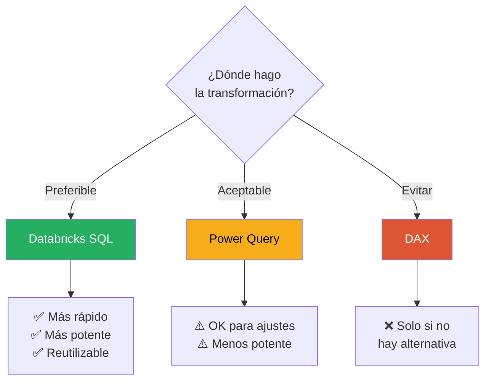
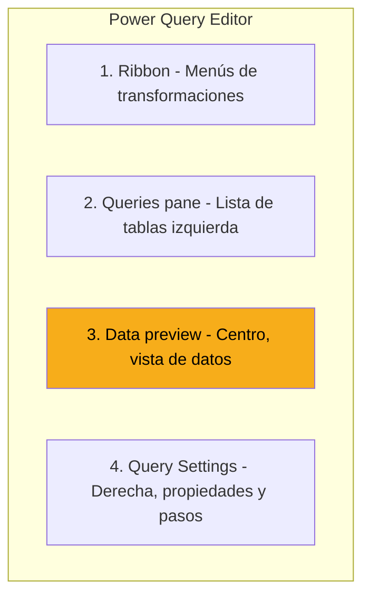
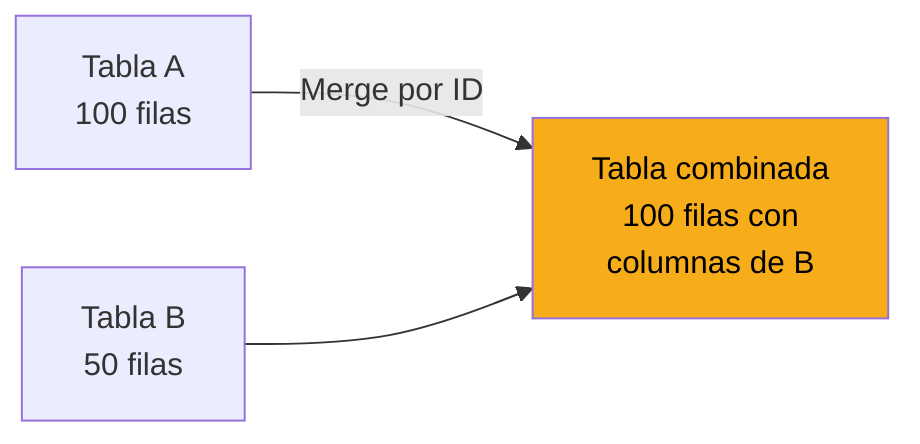
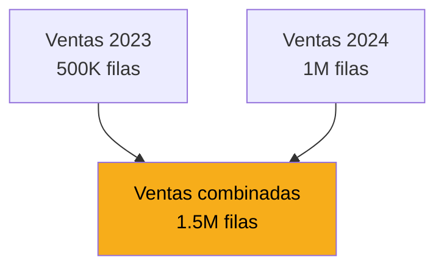
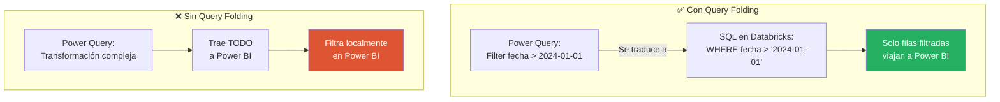

# Power Query para Analistas

Power Query es el paso previo al modelo. Es donde limpias, transformas y preparas los datos antes de que lleguen a Power BI. Esta lección te enseña lo esencial sin entrar al lenguaje M en profundidad.

---

## ¿Cuándo usar Power Query?



### Regla de oro

| Transformación | Dónde hacerla |
|---|---|
| Cálculos complejos, joins de 5+ tablas | 🟢 **Databricks SQL** |
| Limpieza pesada, filtros de millones de filas | 🟢 **Databricks SQL** |
| Renombrar columnas | 🟡 **Power Query** |
| Cambiar tipos de datos | 🟡 **Power Query** |
| Crear columna simple (concatenación, formato) | 🟡 **Power Query** |
| Métricas agregadas (SUM, AVG, CALCULATE) | 🔵 **DAX** |

> 💡 **Principio fundamental:** transforma lo máximo en la fuente, lo mínimo en Power Query, y lo estrictamente agregativo en DAX.

---

## Abrir Power Query Editor

Hay varias formas de llegar:

**Opción 1:** `Home → Transform data`

**Opción 2:** Durante Get Data, click en **Transform Data** en lugar de Load

[SCREENSHOT: Ventana de Power Query Editor con áreas principales]

---

## Anatomía de Power Query Editor



### 1. Ribbon superior

Todas las transformaciones disponibles organizadas en tabs: Home, Transform, Add Column, View.

### 2. Queries pane (izquierda)

Lista de tablas cargadas. Click en una para ver sus datos y transformaciones.

### 3. Data preview (centro)

Preview de la tabla seleccionada. Lo que ves son los primeros 1000 registros típicamente, no la tabla completa.

### 4. Query Settings (derecha)

Panel crítico. Muestra dos cosas:

- **Properties:** nombre de la tabla
- **Applied Steps:** lista cronológica de todas las transformaciones aplicadas

> 💡 **Los Applied Steps son el historial de tus transformaciones.** Cada paso es reversible. Puedes hacer click en cualquier paso anterior para "volver en el tiempo".

---

## Las transformaciones más usadas

Estas son las 10 transformaciones que vas a hacer el 90% del tiempo:

### 1. Cambiar tipo de columna

Muchas veces Power BI infiere mal los tipos. Corregirlos es de los primeros ajustes.

**Cómo:** click derecho en el header de la columna → **Change Type** → elegir el tipo correcto.

| Tipo | Cuándo usarlo |
|---|---|
| **Text** | Texto, IDs que no son numéricos |
| **Whole Number** | Enteros (cantidad, IDs numéricos) |
| **Decimal Number** | Números con decimales (monto, porcentaje) |
| **Date** | Fechas sin hora |
| **Date/Time** | Fechas con hora |
| **True/False** | Booleanos |

> ⚠️ **Atención:** cambiar el tipo con datos incompatibles (ej: "ABC" a Whole Number) genera errores que Power BI marca como `Error`. Revísalos y corrígelos.

### 2. Renombrar columnas

**Cómo:** doble click en el header → escribir nuevo nombre.

**Convenciones recomendadas:**

| ❌ Evitar | ✅ Preferir |
|---|---|
| `mnt_vta` | `monto_venta` |
| `PROD_ID` | `producto_id` |
| `desc` | `descripcion` |
| `fch` | `fecha` |

Nombres descriptivos > nombres cortos crípticos. Estos nombres los van a ver los usuarios finales en el reporte.

### 3. Eliminar columnas

**Cómo:** click derecho en el header → **Remove**.

Para eliminar varias:

- **Ctrl + click** en varios headers
- Click derecho → **Remove Columns**

**Alternativa útil:** seleccionar las que SÍ quieres → click derecho → **Remove Other Columns**.

> 💡 **Elimina agresivamente las columnas que no uses.** Cada columna pesa. Menos columnas = modelo más rápido y pequeño.

### 4. Filtrar filas

**Cómo:** click en la flecha del header de una columna → elegir condición de filtro.

[SCREENSHOT: Menú de filtro desplegado en una columna]

**Ejemplos:**

| Filtro | Resultado |
|---|---|
| `fecha > 2024-01-01` | Solo datos de 2024 en adelante |
| `monto > 0` | Excluir ventas negativas o nulas |
| `pais in ('SV', 'HN', 'NI')` | Solo los 3 países de CBC |
| `categoria != null` | Excluir filas sin categoría |

### 5. Reemplazar valores

**Cómo:** click derecho en una columna → **Replace Values**.

**Casos típicos:**

- Normalizar "El Salvador" y "EL SALVADOR" → "El Salvador"
- Reemplazar `null` por "Sin asignar"
- Estandarizar códigos mal escritos

### 6. Dividir columna

**Cómo:** click derecho → **Split Column** → elegir separador.

**Ejemplo:** columna `nombre_completo` = "Juan Pérez García" → dividir por espacio → `Juan`, `Pérez`, `García`

### 7. Concatenar columnas

**Cómo:** seleccionar columnas → **Transform → Merge Columns**.

**Ejemplo:** `año` + `mes` + `día` → `fecha_concatenada`

### 8. Extraer valores

**Cómo:** click derecho → **Transform → Extract**.

**Opciones:**

| Opción | Uso |
|---|---|
| First Characters | Primeros N caracteres |
| Last Characters | Últimos N caracteres |
| Range | Caracteres entre posiciones |
| Text Before Delimiter | Texto antes de un separador |
| Text After Delimiter | Texto después de un separador |

### 9. Crear columna condicional

**Cómo:** `Add Column → Conditional Column`.

Se abre un wizard para definir reglas if/then/else sin escribir código.

**Ejemplo:** crear columna `segmento_cliente`:

| Si | Entonces |
|---|---|
| `monto_anual > 100000` | "Premium" |
| `monto_anual > 10000` | "Mediano" |
| En otro caso | "Básico" |

### 10. Group By (agrupar)

**Cómo:** `Home → Group By`.

Equivale a `GROUP BY` en SQL. Permite agregar datos al nivel que quieras.

**Ejemplo:** tienes 1M de transacciones. Las agrupas por `categoria` y `fecha` para obtener el total diario por categoría (resultado: miles de filas en vez de millones).

---

## Los Applied Steps: tu historial

Cada transformación se registra como un paso en el panel derecho. Esto es oro.

[SCREENSHOT: Applied Steps con varios pasos en orden]

### Lo que puedes hacer con los pasos:

| Acción | Cómo |
|---|---|
| **Ver el resultado de un paso** | Click sobre el paso |
| **Eliminar un paso** | Click en la X junto al paso |
| **Renombrar un paso** | Click derecho → Rename |
| **Reordenar pasos** | Arrastrar hacia arriba/abajo (con cuidado) |
| **Editar un paso** | Click en el engranaje junto al paso |

> ⚠️ **Cuidado al reordenar o eliminar pasos.** Si un paso depende de otro anterior, puede romperse. Prueba los cambios después de cada modificación.

### Buenas prácticas con los pasos

- ✅ Renombra los pasos importantes con nombres claros (ej: "Filter only CBC countries")
- ✅ Mantén los pasos en orden lógico
- ❌ No dejes pasos inútiles o duplicados

---

## Merge y Append: combinar tablas

### Merge (como LEFT JOIN en SQL)

Combina columnas de dos tablas basándose en una columna común.



**Cómo:** `Home → Merge Queries`.

**Ejemplo:** agregar info de productos a la tabla de ventas.

> 💡 **En modelo estrella, NO hagas merge.** En su lugar, mantén las tablas separadas y usa relaciones. El merge es para casos donde realmente necesitas una tabla combinada.

### Append (como UNION en SQL)

Apila filas de dos tablas con las mismas columnas.



**Cómo:** `Home → Append Queries`.

**Ejemplo típico:** unir ventas de varios archivos o varios años.

---

## El lenguaje M (sin entrar en detalles)

Detrás de todas las transformaciones de Power Query hay un lenguaje llamado **M**. Cuando haces click en los botones del Ribbon, Power BI genera código M automáticamente.

**Para ver el código M:**

- De una tabla completa: `View → Advanced Editor`
- De un paso individual: barra de fórmulas arriba (similar a Excel)

[SCREENSHOT: Advanced Editor con código M visible]

**Ejemplo de código M:**

```m
let
    Source = DatabricksQuery.Contents("adb-xxx.azuredatabricks.net", "/sql/1.0/warehouses/yyy"),
    Navigation = Source{[Name="cbc_prod"]}[Data],
    ventas_transacciones = Navigation{[Name="ventas.transacciones"]}[Data],
    FilteredRows = Table.SelectRows(ventas_transacciones, each [fecha] >= #date(2024, 1, 1)),
    RemovedColumns = Table.RemoveColumns(FilteredRows, {"metadata", "audit_user"})
in
    RemovedColumns
```

> 💡 **No necesitas escribir M manualmente al principio.** Los botones del Ribbon cubren el 95% de los casos. Aprende M cuando necesites algo que el Ribbon no ofrezca.

---

## Query Folding: la optimización mágica

Aquí viene un concepto crítico para rendimiento: **Query Folding**.

### ¿Qué es?

Power Query intenta **empujar las transformaciones a la fuente de datos** cuando sea posible. En vez de traer 10M filas y filtrarlas localmente, traduce el filtro a SQL y lo ejecuta en Databricks.



### ¿Por qué importa?

- **Con folding:** consultas rápidas, tráfico bajo, uso eficiente de Databricks
- **Sin folding:** consultas lentas, tráfico alto, memoria saturada

### ¿Qué operaciones soportan folding?

| Operación | Folding |
|---|---|
| Filtrar filas | ✅ Sí |
| Seleccionar columnas | ✅ Sí |
| Group By | ✅ Sí |
| Renombrar columnas | ✅ Sí |
| Merge con otra tabla de la misma fuente | ✅ Sí |
| Columna calculada simple | ⚠️ Depende |
| Transformaciones de texto complejas | ❌ No siempre |
| Custom functions | ❌ No |

### Cómo saber si un paso está haciendo folding

Click derecho sobre un paso → **View Native Query**.

- Si se muestra el SQL generado = folding ✅
- Si la opción está gris = no folding ❌

> 💡 **Regla práctica:** pon las transformaciones que hacen folding PRIMERO en los Applied Steps. Una vez que una transformación rompe el folding, todas las siguientes también lo rompen.

---

## Aplicar cambios y volver al modelo

Cuando termines de hacer transformaciones en Power Query:

**`Home → Close & Apply`**

[SCREENSHOT: Botón Close & Apply en el Ribbon]

Power Query se cierra, ejecuta todas las transformaciones, y carga los datos transformados al modelo de Power BI.

> 💡 **Close & Apply puede tomar tiempo** si las transformaciones son pesadas o el dataset es grande. Ten paciencia.

---

## Errores comunes en Power Query

### ❌ "Hice demasiadas transformaciones aquí"

**Problema:** tardas horas en Power Query haciendo cosas que Databricks hace en segundos.

**Solución:** pregúntate "¿esto debería estar en Databricks?". Si sí, muévelo.

### ❌ "Rompí el Query Folding"

**Problema:** una transformación compleja al inicio anula el folding para el resto.

**Solución:** reordenar los pasos, poner primero las operaciones que sí hacen folding.

### ❌ "Tengo columnas con tipos mal inferidos"

**Problema:** Power BI detectó `monto` como texto, `fecha` como número, etc.

**Solución:** revisar todos los tipos manualmente después de cargar.

### ❌ "Mis transformaciones se rompen cuando refresco"

**Problema:** usaste nombres de columnas específicos y la fuente cambió.

**Solución:** hacer las transformaciones más robustas, validar los nombres antes de refrescar.

---

## 🎯 Tareas

**Tarea 1:** En tu `conexion_databricks.pbix`, abre Transform data para entrar a Power Query.

**Tarea 2:** Observa los tipos de columnas de tus tablas. Identifica al menos uno mal inferido y corrígelo.

**Tarea 3:** Elimina columnas que no necesites (seguro hay varias).

**Tarea 4:** Aplica un filtro simple (ej: solo datos de los últimos 12 meses).

**Tarea 5:** Renombra al menos una columna para que sea más legible.

**Tarea 6:** Verifica los Applied Steps. ¿Están en orden lógico?

**Tarea 7:** Verifica si tus pasos están haciendo Query Folding (View Native Query).

**Tarea 8:** Close & Apply. Confirma que las tablas se cargan al modelo con los cambios.

---

*Universidad Nexus — Curso de Power BI para Analistas*
