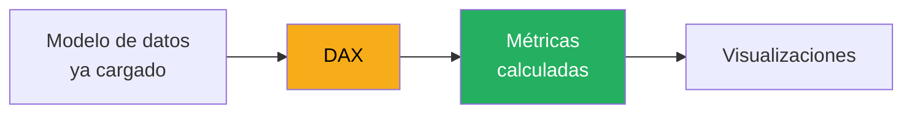
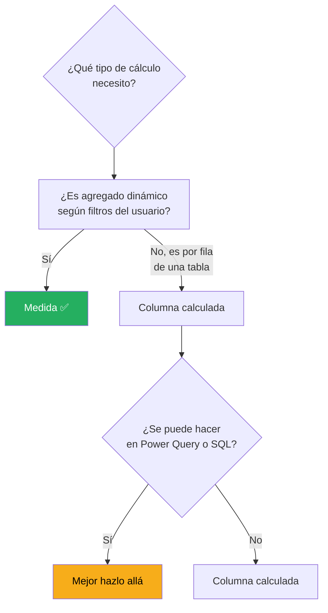
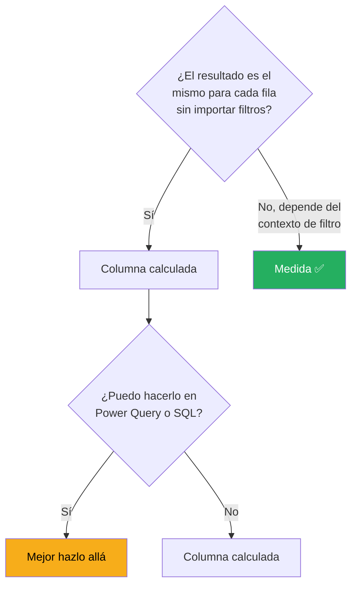
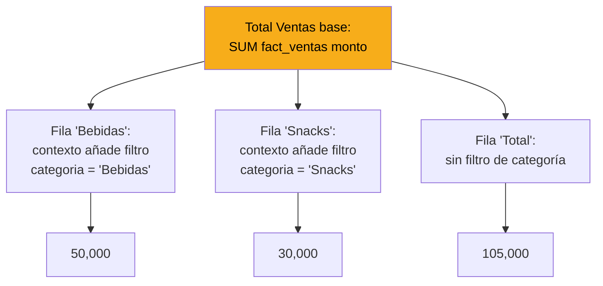

# Fundamentos de DAX

DAX (Data Analysis Expressions) es el lenguaje de fórmulas de Power BI. Si SQL es para consultar datos y Python es para transformarlos, DAX es para **calcular métricas sobre un modelo ya cargado**.

Esta lección te da los fundamentos: qué es DAX, cómo piensa, y las primeras fórmulas que vas a escribir.

---

## DAX en 30 segundos



DAX es el "cerebro" que convierte tus tablas en números útiles. No transforma datos, los calcula en el momento basándose en el contexto del usuario (filtros, slicers, cortes).

---

## Los 3 tipos de cálculos en DAX

DAX se usa para 3 cosas distintas. Cada una con su propósito:

| Tipo | Qué es | Ejemplo | Cuándo usarlo |
|---|---|---|---|
| **Medida** (Measure) | Cálculo agregado dinámico | `Total Ventas = SUM(ventas[monto])` | ⭐ La mayoría del tiempo |
| **Columna calculada** | Nueva columna en una tabla | `Año = YEAR(ventas[fecha])` | Rara vez, casi siempre hay alternativa mejor |
| **Tabla calculada** | Tabla nueva generada con DAX | `dim_fecha = CALENDAR(...)` | Casos específicos (tablas de calendario) |

### La regla: 90% medidas

El 90% de tu trabajo con DAX va a ser crear **medidas**. Las columnas calculadas son raras. Las tablas calculadas son excepcionales.



---

## Tu primera medida

Vamos a crear la medida más básica: total de ventas.

### Paso 1: Crear la medida

En Power BI Desktop, con una tabla seleccionada:

- Click derecho sobre la tabla → **New measure**
- O en el Ribbon: `Home → New measure`

[SCREENSHOT: Barra de fórmulas con una medida siendo escrita]

Se abre la barra de fórmulas arriba del canvas.

### Paso 2: Escribir la fórmula

```dax
Total Ventas = SUM(fact_ventas[monto])
```

Desglose:

| Parte | Significado |
|---|---|
| `Total Ventas` | Nombre de la medida |
| `=` | Asignación |
| `SUM(...)` | Función que suma |
| `fact_ventas[monto]` | Referencia a la columna `monto` de la tabla `fact_ventas` |

### Paso 3: Confirmar

Presiona **Enter** o click en el check.

La medida aparece en el Data pane con un ícono distintivo (una calculadora pequeña):

[SCREENSHOT: Data pane mostrando la medida recién creada]

### Paso 4: Usar la medida

Arrastra la medida a un visual (por ejemplo, una Card):

[SCREENSHOT: Card visual mostrando el resultado de Total Ventas]

**¡Acabas de crear tu primera medida!**

---

## Sintaxis básica de DAX

DAX se parece a Excel pero con algunas diferencias clave.

### Referencias a columnas

```dax
'fact_ventas'[monto]
```

- El nombre de la tabla va entre comillas simples si tiene espacios o caracteres especiales
- El nombre de la columna va entre corchetes
- Si la tabla no tiene caracteres raros, las comillas son opcionales: `fact_ventas[monto]`

### Referencias a medidas

```dax
[Total Ventas]
```

Las medidas van solo entre corchetes, **sin nombre de tabla**.

> 💡 **Convención:** siempre referencia columnas con `tabla[columna]` y medidas con `[medida]`. Hace el código mucho más legible.

### Operadores matemáticos

```dax
// Suma, resta, multiplicación, división
[Total Ventas] + [Total Costos]
[Total Ventas] - [Descuentos]
[Cantidad] * [Precio Unitario]
[Ganancia] / [Ventas]
```

### Comentarios

```dax
// Comentario de una línea

/* 
   Comentario
   de varias líneas
*/
```

### Funciones

DAX tiene cientos de funciones. Se llaman igual que en Excel a veces: `SUM`, `AVERAGE`, `COUNT`, `IF`, pero con comportamientos distintos.

---

## Las 10 funciones DAX que MÁS vas a usar

Si dominas estas 10, cubres el 80% de tus necesidades.

### 1. SUM

Suma los valores de una columna.

```dax
Total Ventas = SUM(fact_ventas[monto])
```

### 2. AVERAGE

Promedio de una columna.

```dax
Precio Promedio = AVERAGE(fact_ventas[precio_unitario])
```

### 3. COUNT y COUNTROWS

`COUNT` cuenta valores no nulos de una columna. `COUNTROWS` cuenta filas de una tabla.

```dax
Transacciones = COUNTROWS(fact_ventas)
Productos con Ventas = COUNT(fact_ventas[producto_id])
```

### 4. DISTINCTCOUNT

Cuenta valores únicos. Extremadamente útil.

```dax
Clientes Únicos = DISTINCTCOUNT(fact_ventas[cliente_id])
Productos Vendidos = DISTINCTCOUNT(fact_ventas[producto_id])
```

### 5. DIVIDE

División segura. **Siempre usa `DIVIDE` en lugar de `/` para evitar errores de división por cero**.

```dax
// ❌ Peligroso: puede dar error si el denominador es 0
Margen % = [Ganancia] / [Ventas]

// ✅ Seguro: devuelve 0 si el denominador es 0
Margen % = DIVIDE([Ganancia], [Ventas], 0)
```

El tercer parámetro (opcional) es el valor a devolver si hay división por cero.

### 6. IF

Condicional.

```dax
Estado Venta = 
IF(
    fact_ventas[monto] > 1000,
    "Alta",
    "Baja"
)
```

### 7. SWITCH

Como un `IF` anidado pero más limpio. Úsalo cuando tengas 3+ condiciones.

```dax
Segmento = 
SWITCH(
    TRUE(),
    [Total Ventas] > 100000, "Premium",
    [Total Ventas] > 10000, "Mediano",
    [Total Ventas] > 1000, "Básico",
    "Nuevo"
)
```

### 8. CALCULATE

**La función más importante de DAX**. Permite modificar el contexto de filtro de un cálculo.

```dax
Ventas Bebidas = 
CALCULATE(
    [Total Ventas],
    dim_productos[categoria] = "Bebidas"
)
```

Desglose:

- `[Total Ventas]` es la métrica base
- El segundo argumento es un filtro
- `CALCULATE` evalúa la métrica pero aplicando ese filtro adicional

Vas a usar `CALCULATE` todo el tiempo. Es el cuchillo suizo de DAX.

### 9. FILTER

Crea una tabla filtrada que puedes usar en otras funciones.

```dax
Ventas Altas = 
CALCULATE(
    [Total Ventas],
    FILTER(fact_ventas, fact_ventas[monto] > 1000)
)
```

### 10. RELATED

Trae una columna de una tabla relacionada (en columnas calculadas).

```dax
// En una columna calculada de fact_ventas:
Categoria Producto = RELATED(dim_productos[categoria])
```

---

## Medidas vs columnas calculadas: cuándo cada una

Esta confusión es común al empezar. Aquí está la diferencia fundamental:

| Aspecto | Columna calculada | Medida |
|---|---|---|
| **Cuándo se calcula** | Al cargar/refrescar datos | En el momento, según contexto |
| **Dónde vive** | En la tabla, como columna más | Como función independiente |
| **Ocupa memoria** | ✅ Sí, una vez por fila | ❌ No, se calcula al vuelo |
| **Puede cambiar con filtros** | ❌ No | ✅ Sí |
| **Para qué sirve** | Valores fijos por fila | Agregados dinámicos |

### Ejemplo del mismo cálculo, ambas formas

**Como columna calculada:**

```dax
// En fact_ventas:
Año Venta = YEAR(fact_ventas[fecha])
```

Cada fila ahora tiene una columna `Año Venta` con el año correspondiente. Ocupa espacio para siempre.

**Como medida:**

```dax
// Medida que cuenta ventas del año actual
Ventas 2024 = 
CALCULATE(
    [Total Ventas],
    YEAR(fact_ventas[fecha]) = 2024
)
```

No ocupa espacio. Se calcula solo cuando alguien lo usa en un visual.

### Regla práctica



En la práctica: **casi siempre usa medidas**.

---

## Contexto de filtro: el concepto más importante

Este es el concepto que más cuesta entender al principio y el que más importa.

### ¿Qué es el contexto de filtro?

Cuando colocas una medida en un visual, esa medida se calcula para **cada combinación de filtros aplicados**. Los filtros pueden venir de:

- La fila/columna del visual (ej: fila "Bebidas" en una tabla)
- Slicers en la página
- Filtros de nivel página o reporte
- Interacción con otros visuales

### Ejemplo práctico

Tienes esta medida:

```dax
Total Ventas = SUM(fact_ventas[monto])
```

Y la usas en una matriz agrupada por `categoria`:

| categoria | Total Ventas |
|---|---|
| Bebidas | 50,000 |
| Snacks | 30,000 |
| Lácteos | 25,000 |
| **Total** | **105,000** |

¿Por qué cada fila muestra un número distinto?



**Cada fila modifica el contexto de filtro, y la medida se recalcula según ese contexto.** Por eso las medidas son dinámicas.

### CALCULATE cambia el contexto

`CALCULATE` es especial porque puede **sobrescribir** el contexto de filtro:

```dax
Ventas Bebidas Siempre = 
CALCULATE(
    [Total Ventas],
    dim_productos[categoria] = "Bebidas"
)
```

Aunque el usuario ponga filtros de otras categorías, esta medida siempre calcula las ventas de Bebidas.

| categoria | Total Ventas | Ventas Bebidas Siempre |
|---|---|---|
| Bebidas | 50,000 | 50,000 |
| Snacks | 30,000 | **50,000** ← ignora el filtro de Snacks |
| Lácteos | 25,000 | **50,000** ← ignora el filtro de Lácteos |

> 💡 **Esta capacidad de sobrescribir el contexto es la razón por la que `CALCULATE` es tan poderosa.** Todas las métricas avanzadas la usan.

---

## Formato de medidas

Las medidas numéricas deben tener formato legible. Power BI las muestra "raw" por defecto.

### Cambiar el formato

1. Selecciona la medida en el Data pane
2. En el Ribbon: `Measure Tools → Format`
3. Elige:
   - **Decimal Number** (`1234.56`)
   - **Whole Number** (`1235`)
   - **Percentage** (`12.5%`)
   - **Currency** (`$1,234.56`)
   - **Custom** (formato personalizado)

[SCREENSHOT: Opciones de formato en Measure Tools]

### Formato personalizado

Para formato con separador de miles:

```
#,##0
```

Para moneda de CBC (GTQ, HNL, NIO, USD):

```
"Q"#,##0.00
```

Para porcentaje con 1 decimal:

```
0.0%
```

> 💡 **Formatea las medidas desde el inicio.** Un reporte sin formato se ve poco profesional.

---

## Organizar medidas

Cuando tienes muchas medidas (vas a tener muchas), es fácil perderse. Power BI permite organizarlas en **carpetas de display**.

### Crear carpetas

1. Selecciona una medida
2. En el panel `Properties` (a la derecha en Model view)
3. En `Display folder`, escribe el nombre de la carpeta

**Carpetas típicas:**

- 📁 `Ventas`
- 📁 `Margen`
- 📁 `Comparativos`
- 📁 `Tiempo`

Las medidas se agrupan visualmente en el Data pane.

[SCREENSHOT: Data pane con medidas organizadas en carpetas]

### Tabla de medidas

Otra técnica popular: crear una tabla vacía llamada `_Measures` (o similar) y guardar todas las medidas ahí, separadas de las tablas de datos.

**Cómo:**

1. `Home → Enter data`
2. Nombre: `_Medidas`
3. Dejar una columna vacía, confirmar
4. En Model view, seleccionar la tabla
5. Crear todas las medidas "en" esa tabla
6. Opcional: ocultar la columna dummy

Al final, tienes una tabla limpia con solo las medidas, que aparece al inicio del Data pane.

> 💡 **Las tablas de medidas y las carpetas hacen tu modelo mucho más navegable.** Adóptalas desde el primer reporte.

---

## 🎯 Tareas

**Tarea 1:** En tu `.pbix`, crea tu primera medida: `Total Ventas = SUM(fact_ventas[monto])`.

**Tarea 2:** Crea una Card visual que muestre el total.

**Tarea 3:** Crea otras 3 medidas básicas:
- `Total Transacciones = COUNTROWS(fact_ventas)`
- `Ticket Promedio = DIVIDE([Total Ventas], [Total Transacciones])`
- `Clientes Únicos = DISTINCTCOUNT(fact_ventas[cliente_id])`

**Tarea 4:** Formatea cada medida apropiadamente (moneda, entero, etc.).

**Tarea 5:** Crea una medida con `CALCULATE`:
- `Ventas Bebidas = CALCULATE([Total Ventas], dim_productos[categoria] = "Bebidas")`

**Tarea 6:** Crea una matriz con `categoria` en filas y arrastra `Total Ventas` y `Ventas Bebidas`. Observa cómo se comportan distinto al aplicar filtros.

**Tarea 7:** Organiza tus medidas en una tabla `_Medidas` o en carpetas de display.

---

*Universidad Nexus — Curso de Power BI para Analistas*
