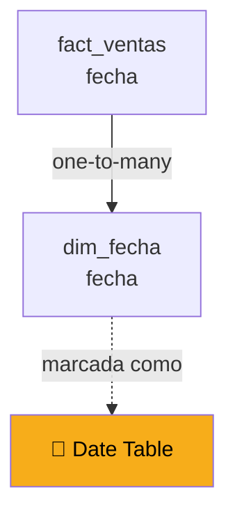
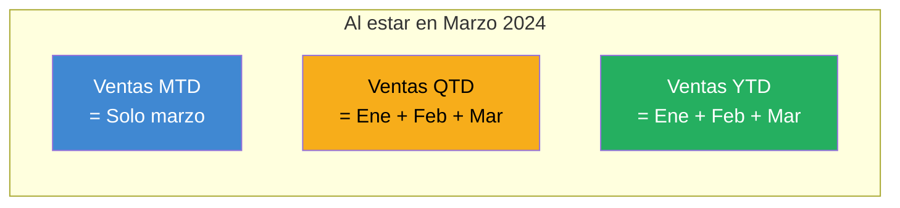
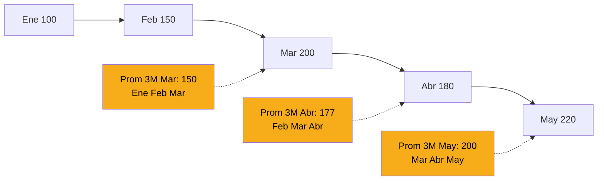
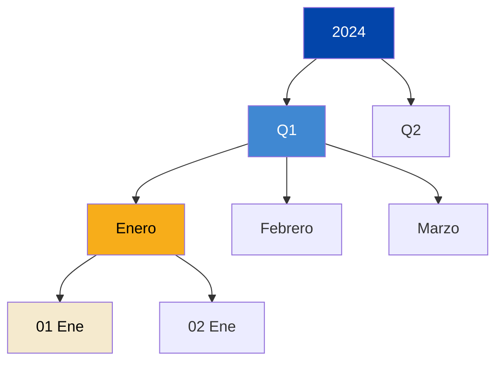

# Time Intelligence

Una de las cosas más valiosas que puedes hacer con DAX son comparaciones de tiempo: "¿cómo va este mes vs el mes anterior?", "¿creció el año contra el año pasado?", "¿cuál es el acumulado del trimestre?". Power BI tiene funciones específicas para esto, colectivamente llamadas **Time Intelligence**.

---

## Lo que vas a aprender a calcular

Después de esta lección vas a poder responder preguntas como:

| Pregunta del negocio | Fórmula DAX |
|---|---|
| "¿Cuánto vendimos este mes?" | Medida base + filtro de mes actual |
| "¿Cuánto vendimos el mes pasado?" | `DATEADD` -1 mes |
| "¿Crecimos vs el mes pasado?" | % de variación |
| "¿Cuál es el YTD del año?" | `TOTALYTD` |
| "¿Cómo va el año vs el año pasado?" | `SAMEPERIODLASTYEAR` |
| "¿Cuál es el promedio móvil de 3 meses?" | `DATESINPERIOD` + agregación |

---

## Prerrequisito: tabla de calendario marcada

Para que las funciones de time intelligence funcionen correctamente, necesitas:

1. ✅ Una **tabla de calendario** (`dim_fecha`) con todas las fechas
2. ✅ La tabla **marcada como "Date table"** (click derecho → Mark as date table)
3. ✅ **Relación** entre `dim_fecha[fecha]` y la columna de fecha de la fact table

Si no tienes esto, vuelve a la sección de modelado antes de avanzar.



---

## Las funciones esenciales de tiempo

### 1. TOTALYTD — Year To Date

Calcula el acumulado del año hasta la fecha en contexto.

```dax
Ventas YTD = TOTALYTD([Total Ventas], dim_fecha[fecha])
```

**Resultado:** al estar en un contexto de fecha (ej: marzo 2024), devuelve la suma de enero + febrero + marzo.

### 2. TOTALQTD — Quarter To Date

Acumulado del trimestre hasta la fecha.

```dax
Ventas QTD = TOTALQTD([Total Ventas], dim_fecha[fecha])
```

### 3. TOTALMTD — Month To Date

Acumulado del mes hasta la fecha.

```dax
Ventas MTD = TOTALMTD([Total Ventas], dim_fecha[fecha])
```

### Visualización del concepto



---

## SAMEPERIODLASTYEAR — Comparación anual

Probablemente la comparación más pedida: "¿cuánto vendimos este mes vs el mismo mes del año pasado?".

```dax
Ventas AA = 
CALCULATE(
    [Total Ventas],
    SAMEPERIODLASTYEAR(dim_fecha[fecha])
)
```

"AA" significa "año anterior". Cuando el contexto es marzo 2024, devuelve las ventas de marzo 2023.

### Variación año contra año

Con la medida anterior, calcular el % de crecimiento:

```dax
Variación YoY % = 
VAR VentasActuales = [Total Ventas]
VAR VentasAnteriores = [Ventas AA]
VAR Variacion = DIVIDE(VentasActuales - VentasAnteriores, VentasAnteriores, 0)
RETURN Variacion
```

### Uso de variables (VAR)

Observa el uso de `VAR` y `RETURN` en el ejemplo anterior. Son una característica clave de DAX moderno:

| Ventaja | Detalle |
|---|---|
| 📖 **Legibilidad** | El código se lee como una receta |
| ⚡ **Performance** | Cada variable se calcula una sola vez |
| 🐛 **Debugging** | Puedes comentar pasos intermedios |

**Sintaxis:**

```dax
Nombre Medida = 
VAR NombreVariable1 = <expresión1>
VAR NombreVariable2 = <expresión2>
RETURN <expresión final que usa las variables>
```

> 💡 **Usa variables siempre que tu medida tenga más de una línea.** Hace el código mucho más profesional.

---

## DATEADD — Comparaciones más flexibles

`SAMEPERIODLASTYEAR` es específica de año a año. Para cualquier otra comparación de tiempo, usa `DATEADD`:

```dax
// Ventas del mes anterior
Ventas Mes Anterior = 
CALCULATE(
    [Total Ventas],
    DATEADD(dim_fecha[fecha], -1, MONTH)
)

// Ventas de hace 3 meses
Ventas Hace 3 Meses = 
CALCULATE(
    [Total Ventas],
    DATEADD(dim_fecha[fecha], -3, MONTH)
)

// Ventas del día anterior
Ventas Día Anterior = 
CALCULATE(
    [Total Ventas],
    DATEADD(dim_fecha[fecha], -1, DAY)
)
```

**Parámetros de DATEADD:**

| Parámetro | Qué es |
|---|---|
| 1: columna de fecha | `dim_fecha[fecha]` |
| 2: número | Positivo o negativo |
| 3: unidad | `DAY`, `MONTH`, `QUARTER`, `YEAR` |

---

## DATESINPERIOD — Promedios móviles

Para calcular promedios móviles (rolling averages), una métrica muy usada en análisis de tendencias:

```dax
// Promedio móvil de 3 meses
Ventas Promedio 3M = 
CALCULATE(
    [Total Ventas],
    DATESINPERIOD(
        dim_fecha[fecha],
        MAX(dim_fecha[fecha]),
        -3,
        MONTH
    )
) / 3
```

O usando `AVERAGEX` para más precisión:

```dax
Ventas Promedio 3M v2 = 
AVERAGEX(
    DATESINPERIOD(
        dim_fecha[fecha],
        MAX(dim_fecha[fecha]),
        -3,
        MONTH
    ),
    [Total Ventas]
)
```

### Visualización de promedios móviles



Suaviza las fluctuaciones mes a mes y muestra la tendencia real.

---

## PARALLELPERIOD — Comparaciones sin filtro de fecha

`PARALLELPERIOD` es similar a `DATEADD` pero devuelve el periodo completo, ignorando el día específico.

```dax
// Ventas del mismo mes del año pasado (mes completo)
Ventas Mismo Mes AP = 
CALCULATE(
    [Total Ventas],
    PARALLELPERIOD(dim_fecha[fecha], -12, MONTH)
)
```

**Diferencia con `SAMEPERIODLASTYEAR`:**

| Función | Comportamiento |
|---|---|
| `SAMEPERIODLASTYEAR` | Mismo rango exacto un año atrás (si estás en "1 al 15 de marzo 2024", te da "1 al 15 de marzo 2023") |
| `PARALLELPERIOD -12 MONTH` | Desplaza 12 meses completos (similar en este caso) |

En la práctica, para comparaciones anuales, ambas funcionan. `SAMEPERIODLASTYEAR` es más legible.

---

## Casos reales de uso en CBC

### Caso 1: KPI de crecimiento mensual

**Necesidad:** una card que muestre las ventas del mes y el % de crecimiento vs el mes anterior.

```dax
// Medida 1: Ventas del mes actual
Ventas Mes Actual = 
CALCULATE(
    [Total Ventas],
    DATESMTD(dim_fecha[fecha])
)

// Medida 2: Ventas del mes anterior
Ventas Mes Anterior = 
CALCULATE(
    [Total Ventas],
    DATEADD(dim_fecha[fecha], -1, MONTH)
)

// Medida 3: % de crecimiento
Crecimiento MoM % = 
VAR Actual = [Ventas Mes Actual]
VAR Anterior = [Ventas Mes Anterior]
RETURN DIVIDE(Actual - Anterior, Anterior, 0)
```

### Caso 2: Análisis YoY por trimestre

**Necesidad:** comparar cada trimestre del año actual con el mismo trimestre del año anterior.

```dax
Ventas QTD AA = 
CALCULATE(
    [Total Ventas],
    SAMEPERIODLASTYEAR(dim_fecha[fecha])
)

Crecimiento Q YoY % = 
VAR Actual = [Ventas QTD]
VAR Anterior = [Ventas QTD AA]
RETURN DIVIDE(Actual - Anterior, Anterior, 0)
```

Usar en una matriz con `dim_fecha[trimestre]` en filas y `dim_fecha[año]` en columnas.

### Caso 3: Detectar caídas vs tendencia

**Necesidad:** señal cuando las ventas del mes caen más del 10% vs el promedio móvil de 3 meses.

```dax
Alerta Caída = 
VAR VentasMes = [Ventas Mes Actual]
VAR PromedioMovil = [Ventas Promedio 3M]
VAR Variacion = DIVIDE(VentasMes - PromedioMovil, PromedioMovil, 0)
RETURN
    IF(Variacion < -0.10, "⚠️ Caída", "✅ Normal")
```

---

## Jerarquía de fechas

Power BI crea automáticamente jerarquías para columnas de fecha. Esto permite que los usuarios hagan drill-down:

```
Año → Trimestre → Mes → Día
```

### Crear jerarquía manual (recomendado)

En Model view:

1. Click derecho sobre `dim_fecha`
2. **Create hierarchy**
3. Arrastra las columnas en el orden: `año` → `trimestre` → `mes` → `fecha`
4. Nombre: `Fecha Jerarquía`

[SCREENSHOT: Creación de jerarquía en Model view]

Al usar esta jerarquía en un visual, los usuarios pueden expandir/colapsar niveles:



---

## Funciones DAX de tiempo: cheat sheet

| Función | Qué devuelve |
|---|---|
| `TOTALYTD` | Acumulado del año hasta la fecha |
| `TOTALQTD` | Acumulado del trimestre hasta la fecha |
| `TOTALMTD` | Acumulado del mes hasta la fecha |
| `SAMEPERIODLASTYEAR` | Mismo periodo del año anterior |
| `PARALLELPERIOD` | Periodo desplazado N unidades |
| `DATEADD` | Fecha desplazada N unidades |
| `DATESINPERIOD` | Rango de fechas a partir de una |
| `DATESBETWEEN` | Rango entre dos fechas |
| `DATESYTD/QTD/MTD` | Conjunto de fechas YTD/QTD/MTD |
| `PREVIOUSYEAR/QUARTER/MONTH/DAY` | Todas las fechas del periodo anterior |
| `NEXTYEAR/QUARTER/MONTH/DAY` | Todas las fechas del periodo siguiente |
| `STARTOFMONTH/QUARTER/YEAR` | Primera fecha del periodo |
| `ENDOFMONTH/QUARTER/YEAR` | Última fecha del periodo |

---

## Errores comunes en time intelligence

### ❌ "Mis cálculos YoY dan números raros"

**Causa más común:** no marcaste la tabla como "Date table".

**Solución:** Click derecho sobre `dim_fecha` → Mark as date table → elegir columna de fecha.

### ❌ "No tengo datos del año anterior y me da en blanco"

**Causa:** no hay datos en el periodo comparado.

**Solución:** 

```dax
Ventas AA Seguro = 
IF(
    ISBLANK([Ventas AA]),
    0,
    [Ventas AA]
)
```

### ❌ "El cálculo YTD incluye fechas futuras"

**Causa:** tu tabla de calendario incluye fechas futuras (hasta 2030, por ejemplo) y no hay filtro para limitar hasta hoy.

**Solución:** agregar un filtro en la medida:

```dax
Ventas YTD Corregido = 
CALCULATE(
    [Total Ventas],
    DATESYTD(dim_fecha[fecha]),
    dim_fecha[fecha] <= TODAY()
)
```

### ❌ "Mis fechas fiscales no coinciden con el año natural"

**Problema:** el año fiscal de CBC podría empezar en marzo o abril, no en enero.

**Solución:** usar el parámetro opcional de `TOTALYTD`:

```dax
Ventas Año Fiscal = 
TOTALYTD([Total Ventas], dim_fecha[fecha], "03-31")
```

El "03-31" indica que el año fiscal termina el 31 de marzo (ajusta según el calendario fiscal real de CBC).

---

## 🎯 Tareas

**Tarea 1:** Verifica que tu tabla `dim_fecha` está marcada como Date Table.

**Tarea 2:** Crea estas medidas básicas:
- `Ventas YTD = TOTALYTD([Total Ventas], dim_fecha[fecha])`
- `Ventas MTD = TOTALMTD([Total Ventas], dim_fecha[fecha])`
- `Ventas AA = CALCULATE([Total Ventas], SAMEPERIODLASTYEAR(dim_fecha[fecha]))`

**Tarea 3:** Crea una medida de variación YoY %:
```dax
Variación YoY % = 
VAR Actual = [Total Ventas]
VAR Anterior = [Ventas AA]
RETURN DIVIDE(Actual - Anterior, Anterior, 0)
```
Formatéala como porcentaje.

**Tarea 4:** Crea una matriz con `dim_fecha[mes]` en filas y las 4 medidas en valores. Observa los resultados.

**Tarea 5:** Crea un promedio móvil de 3 meses usando `DATESINPERIOD`.

**Tarea 6:** Crea una jerarquía de fecha en `dim_fecha`.

**Tarea 7:** Usa la jerarquía en un visual y practica el drill-down (año → trimestre → mes).

---

*Universidad Nexus — Curso de Power BI para Analistas*
