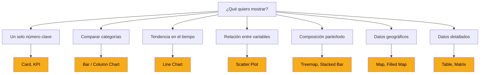
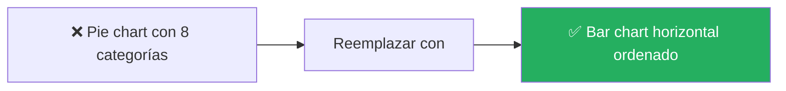
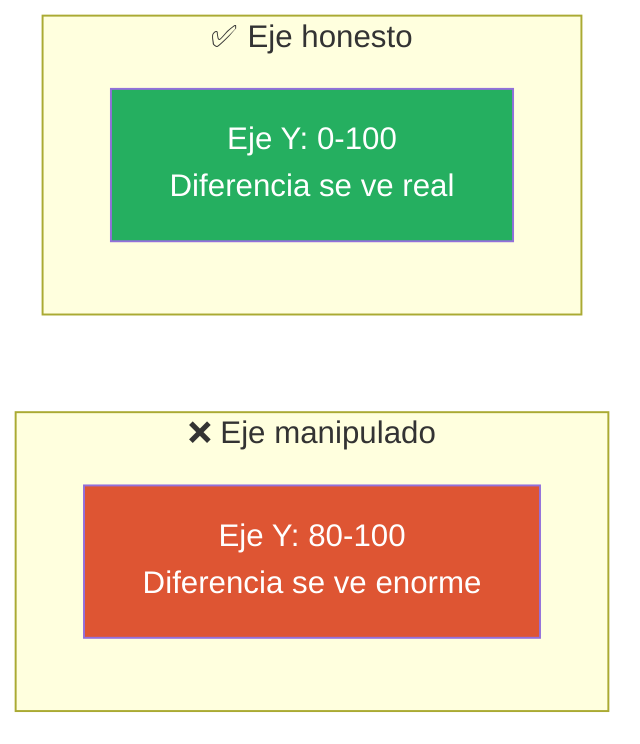

# Elegir el Visual Correcto

**La pregunta correcta no es "¿qué visual es más bonito?" sino "¿qué pregunta de negocio estoy respondiendo?".** Cada tipo de visual responde un tipo específico de pregunta.

---

## La decisión en un árbol



---

## Los visuales esenciales

### 1. Card — El número solitario

**Para qué:** mostrar **un solo número** destacado.

**Cuándo usarlo:**
- KPIs principales (Total Ventas, Clientes Activos)
- Números que deben destacar a primera vista
- En la parte superior de dashboards ejecutivos

[SCREENSHOT: Ejemplo de Card mostrando Total Ventas]

**Tips:**
- ✅ Formato de número apropiado (moneda, porcentaje)
- ✅ Etiqueta clara (no solo el número sin contexto)
- ❌ No abuses: 20 cards en una página es ruido

### 2. KPI — El número con contexto

**Para qué:** mostrar un número **con comparación contra meta** y **tendencia**.

**Ejemplo:**
```
Ventas MTD: $850K
Meta:       $1M  (85% alcanzado)
↗ +12% vs mes anterior
```

[SCREENSHOT: KPI visual con indicador y sparkline]

**Cuándo usarlo:** cuando la meta o la variación es tan importante como el número mismo.

### 3. Bar Chart (horizontal) y Column Chart (vertical)

**Para qué:** comparar **categorías discretas**.

**Diferencia:**

| Bar (horizontal) | Column (vertical) |
|---|---|
| ➡️ Categorías en Y, valores en X | ⬆️ Categorías en X, valores en Y |
| Ideal para muchas categorías | Ideal para pocas categorías |
| Nombres largos caben mejor | Nombres largos se cortan |

[SCREENSHOT: Bar chart vs Column chart comparando ventas por región]

**Tips:**
- ✅ **Ordena por valor**, no alfabéticamente (excepto tiempo)
- ✅ Usa bar horizontal si tienes 6+ categorías
- ❌ No uses 3D
- ❌ No pongas 20+ barras en un solo visual

### 4. Line Chart — Tendencias en el tiempo

**Para qué:** mostrar cómo algo cambia **a lo largo del tiempo**.

[SCREENSHOT: Line chart de ventas mensuales a lo largo de un año]

**Cuándo usarlo:**
- Ventas mensuales en el año
- Tráfico diario del sitio
- Cualquier métrica con eje X = tiempo

**Tips:**
- ✅ Eje Y debe empezar en cero (casi siempre)
- ✅ Máximo 4-5 líneas en un solo gráfico
- ✅ Colores distintivos si hay múltiples líneas
- ❌ No uses line chart para comparar categorías (eso son barras)

### 5. Area Chart — Acumulación en el tiempo

**Para qué:** como line chart pero mostrando **volumen acumulado**.

**Cuándo usarlo:**
- Mostrar la magnitud total, no solo la tendencia
- Cuando quieres que el "área bajo la curva" sea parte del mensaje

**Variante útil:** **Stacked Area** para ver cómo se compone el total por categoría a lo largo del tiempo.

### 6. Pie / Donut Chart — Proporciones

**Para qué:** mostrar **proporción parte-todo**.

> ⚠️ **Advertencia:** los pie charts son fáciles de hacer mal. Reglas estrictas:

**Reglas para usar pie/donut:**

| ✅ Hazlo | ❌ Evítalo |
|---|---|
| Máximo 4-5 categorías | 10+ porciones |
| Diferencias claras de tamaño | Porciones similares |
| Cuando el todo tiene sentido (100%) | Cuando las categorías no suman un total real |

**Mejor alternativa casi siempre:** **bar chart ordenado**.



### 7. Table — Datos detallados

**Para qué:** mostrar **datos fila por fila** con múltiples columnas.

[SCREENSHOT: Table visual con ventas por producto]

**Cuándo usarlo:**
- Datos operacionales: lista de transacciones, órdenes
- Cuando el usuario necesita VER cada registro
- Datos a exportar a Excel

**Tips:**
- ✅ Aplicar formato condicional (barras de datos, íconos) para destacar
- ✅ Ordenar por la columna más importante
- ❌ No uses table cuando un gráfico transmite el mensaje mejor

### 8. Matrix — Tabla cruzada (pivot)

**Para qué:** mostrar datos con **filas Y columnas agrupadoras** (como una tabla dinámica de Excel).

[SCREENSHOT: Matrix con categorías en filas, meses en columnas, ventas en celdas]

**Ejemplo:**

| | Ene | Feb | Mar | Total |
|---|---|---|---|---|
| **Bebidas** | 50K | 55K | 60K | 165K |
| **Snacks** | 30K | 32K | 28K | 90K |
| **Lácteos** | 20K | 25K | 22K | 67K |
| **Total** | 100K | 112K | 110K | 322K |

**Cuándo usarlo:**
- Análisis cruzados: región vs tiempo, categoría vs cliente
- Cuando tablas y matrices son más informativas que gráficos

### 9. Scatter Plot — Relación entre variables

**Para qué:** mostrar la **relación entre dos variables numéricas**.

[SCREENSHOT: Scatter plot mostrando ventas vs número de visitas]

**Cuándo usarlo:**
- Correlaciones: "¿a mayor precio, menor volumen?"
- Identificar outliers
- Comparar clusters (con color como 3ra dimensión)

**Tips:**
- ✅ Identifica y explica los outliers
- ✅ Agrega línea de tendencia si ayuda
- ❌ No lo uses para datos temporales (eso es line chart)

### 10. Map — Datos geográficos

**Para qué:** mostrar datos con **componente geográfico**.

[SCREENSHOT: Mapa con ventas por país/región]

**Variantes:**
- **Map básico:** puntos sobre un mapa
- **Filled Map:** regiones coloreadas (ideal para CBC con 3 países)
- **ArcGIS Map:** opciones avanzadas con Esri

**Tips:**
- ✅ Usa cuando la ubicación es parte del mensaje
- ❌ No uses solo porque "se ve bonito"
- ⚠️ Los mapas requieren datos geográficos limpios (países, ciudades reconocibles)

---

## La tabla de decisión rápida

| Pregunta | Visual recomendado |
|---|---|
| "¿Cuál es el número total de X?" | Card |
| "¿Estamos cumpliendo la meta?" | KPI |
| "¿Quién vende más, A, B o C?" | Bar chart ordenado |
| "¿Cómo ha evolucionado X con el tiempo?" | Line chart |
| "¿Qué porcentaje representa cada categoría?" | Bar chart (o pie si son ≤ 4) |
| "¿Hay relación entre X e Y?" | Scatter plot |
| "¿Dónde están los valores más altos?" | Map o Filled Map |
| "¿Cuánto vendió cada producto cada mes?" | Matrix |
| "¿Cuáles son las top 10 transacciones?" | Table |

---

## Las 10 reglas de oro

### 1. Un visual = un mensaje
Si un visual trata de decir 3 cosas al mismo tiempo, probablemente no dice ninguna con claridad. Divídelo.

### 2. Ordena con propósito
- Por tiempo: cronológicamente
- Por categoría: por valor (ascendente o descendente)
- Por importancia: lo importante a la vista primero

### 3. Empieza el eje Y en cero
Casi siempre. Empezar en otro número exagera diferencias visuales y engaña al lector.



### 4. Menos es más
Un dashboard con 5 visuales claros > uno con 15 apretados. Si dudas, quita.

### 5. Usa color con intención
- **No** colorees cada barra de distinto color "por estética"
- **Sí** usa colores para destacar algo específico (rojo para alerta, verde para positivo)
- **Sí** usa la paleta de CBC (ver sección de diseño)

### 6. Títulos descriptivos
❌ "Ventas"
✅ "Ventas totales por categoría — últimos 12 meses"

Un buen título responde: ¿qué, cuándo, cómo cortado?

### 7. Formato de números legible
- `1500000` → `1.5M` o `1,500,000`
- `0.125` → `12.5%`
- `1234.5678` → `1,234.57`

### 8. Tooltips útiles
Power BI muestra info al pasar el mouse sobre un visual. Asegúrate de que el contenido sea relevante y complete la historia.

### 9. Accesibilidad
- Contrastes suficientes (texto oscuro sobre fondo claro, no gris sobre blanco)
- No dependas solo del color para comunicar (agregar íconos/formas)
- Tamaños de fuente legibles (mínimo 10pt)

### 10. Prueba con un usuario real
Antes de publicar, muéstrale el reporte a alguien del negocio. Observa qué mira primero, qué no entiende. Ajusta.

---

## Errores visuales clásicos

### ❌ Pie chart con 15 porciones

**Problema:** imposible comparar porciones de tamaño similar.

**Solución:** bar chart horizontal ordenado.

### ❌ Gráfico 3D

**Problema:** distorsiona las proporciones, se ve anticuado.

**Solución:** siempre 2D.

### ❌ Muchos colores sin propósito

**Problema:** distrae y no aporta información.

**Solución:** un color principal, otro para destacar excepciones.

### ❌ Labels rotados 45°

**Problema:** difícil de leer.

**Solución:** usa bar horizontal para textos largos.

### ❌ Leyenda en lugar inútil

**Problema:** leyenda al fondo cuando hay espacio al lado.

**Solución:** leyenda cerca del gráfico, o etiquetas directas sobre las barras.

### ❌ Escalas diferentes sin advertencia

**Problema:** dos líneas en un gráfico con escalas distintas engañan visualmente.

**Solución:** eje dual explícito, o dos gráficos separados.

---

## El tipo de visual NO es lo más importante

Después de todo esto, la verdad es:

> 💡 **La elección del tipo de visual importa, pero mucho menos que la pregunta que responde y la claridad con que la responde.** Un bar chart feo que responde la pregunta correcta > un visual exótico bonito que no dice nada.

Enfócate primero en la **pregunta**, después en el **visual**, y al final en el **estilo**.

---

## 🎯 Tareas

**Tarea 1:** En tu `.pbix`, crea una página nueva llamada "Visualizaciones básicas".

**Tarea 2:** Crea al menos 5 visuales distintos con tus datos reales de CBC:
- 1 Card con `Total Ventas`
- 1 Bar chart con ventas por categoría
- 1 Line chart con ventas mensuales
- 1 Matrix con categoría vs mes
- 1 Table con top 10 transacciones

**Tarea 3:** Para cada visual, revisa las 10 reglas de oro. Identifica al menos 2 mejoras por visual.

**Tarea 4:** Aplica las mejoras. Compara antes/después.

**Tarea 5:** Elige UN visual y muéstraselo a un colega. Pregúntale qué entiende. Si no entiende, ajusta.

**Tarea 6 (desafío):** Recrea un visual intencionalmente mal (pie con 10 categorías, eje manipulado, 3D, etc). Después corrígelo. Aprende del contraste.

---

*Universidad Nexus — Curso de Power BI para Analistas*
