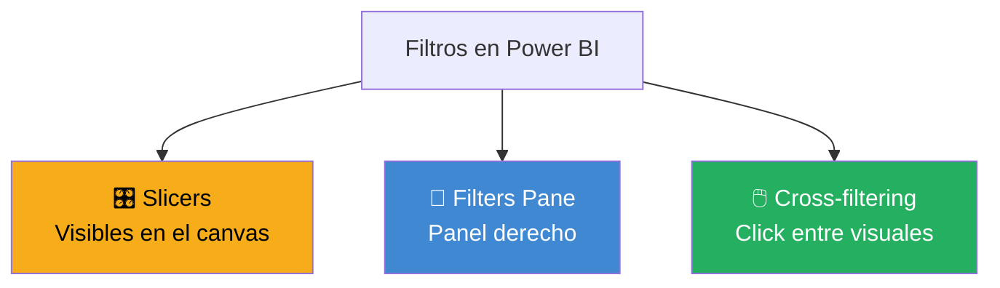
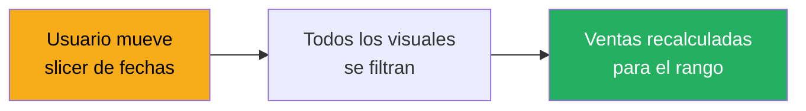
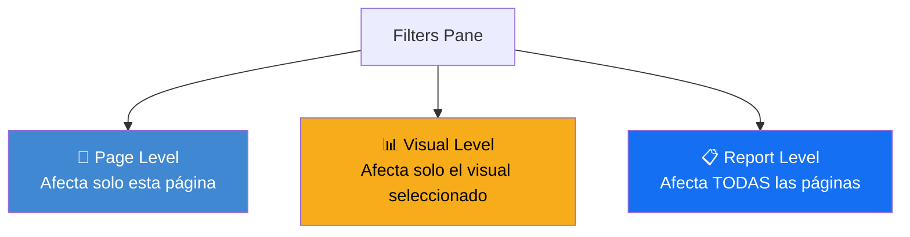
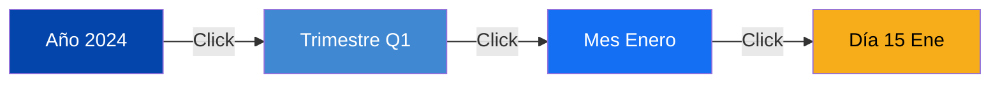
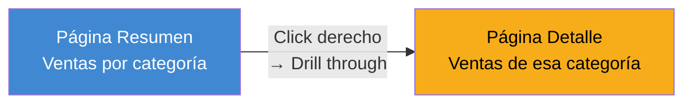

# Interactividad — Filtros, Slicers y Drill-down

Lo que hace a Power BI distinto de una presentación de PowerPoint es la **interactividad**. Los usuarios pueden filtrar, hacer click, explorar, cambiar el foco. Esta lección te enseña a hacer que tus reportes respondan al usuario.

---

## Los 3 tipos de filtros

Los tres funcionan en conjunto. Entender cuándo usar cada uno es clave.

---

## 1. Slicers — Filtros visibles

Los **slicers** son controles que el usuario ve directamente en la página. Son los más visibles e intuitivos.

### Tipos de slicers

[SCREENSHOT: Varios tipos de slicers en una página]

| Tipo | Uso |
|---|---|
| **Lista vertical** | Categorías con ≤ 10 opciones |
| **Dropdown** | Categorías con muchas opciones (ahorra espacio) |
| **Rango numérico** | Filtrar por montos, cantidades |
| **Rango de fechas** | Seleccionar periodos |
| **Botones** | Para datos binarios (sí/no, activo/inactivo) |
| **Tile** | Categorías visuales (iconos, banderas) |

### Cómo crear un slicer

1. En el canvas, click en **Slicer** del Visualizations pane
2. Arrastra la columna que quieres usar como filtro al campo "Field"
3. En el visual del slicer, click en el menú (tres puntos) → elegir el tipo

### Ejemplo: slicer de fechas

**Configurar un slicer de rango de fechas:**

1. Crear slicer con la columna `dim_fecha[fecha]`
2. Cambiar tipo a "Between" (rango)
3. Power BI automáticamente muestra un selector de rango

### Tips para slicers efectivos

| ✅ Hazlo | ❌ Evítalo |
|---|---|
| Ubicarlos al inicio de la página (top o left) | Esparcirlos por todas partes |
| 3-5 slicers por página máximo | 10 slicers (sobrecarga) |
| Usar dropdown cuando hay muchas opciones | Lista larga que ocupa toda la página |
| Títulos claros | "Slicer1", "Slicer2" |

---

## 2. Filters Pane — El panel derecho

Cada visual y cada página tienen un **Filters pane** donde puedes aplicar filtros sin ocupar espacio visual en el canvas.

[SCREENSHOT: Filters pane expandido mostrando los niveles]

### 3 niveles de filtros

### ¿Cuándo usar Filters Pane vs Slicers?

| Usa Slicers cuando... | Usa Filters Pane cuando... |
|---|---|
| El filtro es importante y usado frecuentemente | El filtro es "siempre on" (ej: excluir cancelados) |
| Quieres que el usuario lo vea y cambie | El filtro es técnico, para ajustar el scope |
| Es parte del mensaje del reporte | Quieres ahorrar espacio en el canvas |

---

## 3. Cross-filtering — Click entre visuales

Este es uno de los aspectos más mágicos de Power BI: **al hacer click en un elemento de un visual, el resto de la página se filtra automáticamente**.

[SCREENSHOT: Click en una barra y el resto de la página se filtra]

### Ejemplo visual

Tienes una página con:
- Bar chart de ventas por categoría
- Line chart de ventas mensuales
- Table con top productos

Cuando haces click en la barra "Bebidas":
- El line chart muestra solo la evolución de Bebidas
- La table muestra solo productos de Bebidas
- Todos los demás visuales se ajustan

### Configurar el cross-filtering

Por defecto, cross-filtering está activo entre todos los visuales. Puedes personalizarlo:

1. Selecciona un visual
2. `Format → Edit interactions`
3. Sobre cada otro visual, verás 3 íconos:
   - **Filter** (embudo): filtra el otro visual
   - **Highlight** (sin embudo con líneas): destaca dentro del otro visual
   - **None** (prohibido): no afecta al otro visual

[SCREENSHOT: Modo Edit Interactions mostrando los íconos sobre cada visual]

### Cuándo personalizar

- **Mantener default:** la mayoría del tiempo
- **Desactivar en slicers de navegación:** si tienes slicers que no deben filtrar cierto visual
- **Cambiar a Highlight:** cuando quieres mantener el contexto visible pero destacar

---

## Drill-down: navegación jerárquica

El **drill-down** permite a los usuarios explorar niveles de detalle progresivos.

### Activar drill-down

1. Crea una jerarquía en tu tabla de calendario (año → trimestre → mes → fecha)
2. Arrastra la jerarquía completa a un visual (no solo un nivel)
3. Power BI activa los botones de drill-down en el header del visual

[SCREENSHOT: Visual con botones de drill-down arriba a la derecha]

### Los botones de drill

| Ícono | Acción |
|---|---|
| 🔽 **Drill down** | Expandir al siguiente nivel para el item seleccionado |
| 🔼 **Drill up** | Subir al nivel anterior |
| ⬇️⬇️ **Expand all** | Mostrar todos los items del siguiente nivel |
| 🔽 **Go to next level** | Ir al siguiente nivel manteniendo el contexto |

### Ejemplo de uso

Tienes un bar chart con ventas por `Año → Mes → Día`:

1. Vista inicial: barras de cada año
2. Click derecho en "2024" → **Drill down**
3. Ahora ves las barras de los meses de 2024
4. Click derecho en "Marzo" → **Drill down**
5. Ahora ves los días de marzo 2024

---

## Bookmarks — Vistas guardadas

Los **bookmarks** son estados guardados de una página. Súper útiles para presentaciones, alternativas de vista, y storytelling.

### Casos de uso

- **Vista "Antes vs Después":** bookmark con filtros 2023, otro con 2024
- **Presentación ejecutiva:** bookmarks que funcionan como "diapositivas" del reporte
- **Alternar visuales:** mostrar gráfico A, luego gráfico B en el mismo espacio

### Crear bookmarks

1. `View → Bookmarks pane`
2. Ajusta la página como quieras (filtros, selecciones, etc.)
3. Click en **Add** en el Bookmarks pane
4. Nombra el bookmark

[SCREENSHOT: Bookmarks pane con varios bookmarks guardados]

### Usar bookmarks con botones

Puedes crear botones en el canvas que ejecuten bookmarks al hacer click:

1. `Insert → Buttons → Blank`
2. Formatea el botón (texto, color)
3. En las opciones del botón: **Action → Type → Bookmark**
4. Selecciona el bookmark a activar

Esto te permite crear flujos de navegación personalizados.

---

## Drill-through — Explorar detalles en otra página

El **drill-through** es distinto al drill-down. Permite ir a una **página de detalle** para un elemento específico.

### Configurar drill-through

1. Crea una página de destino (ej: "Detalle Categoría")
2. En esa página, arrastra la columna de filtro al área **Drill through** del Filters pane
3. Power BI automáticamente agrega un botón "Back" a la página de destino
4. En la página de origen, al hacer click derecho sobre un elemento, aparece la opción **Drill through → Detalle Categoría**

### Ejemplo

Tienes un dashboard resumen con ventas por categoría. El usuario hace click derecho en "Bebidas" → **Drill through → Detalle de Categoría**. Lo lleva a una página dedicada con todos los detalles de bebidas: top productos, evolución temporal, márgenes, etc.

---

## Botones de navegación

Un reporte profesional tiene navegación clara entre páginas. No dependas de los tabs inferiores.

### Crear menú de navegación

1. Crea una columna lateral o barra superior con botones
2. Cada botón tiene acción **Action → Page navigation**
3. Apunta a la página correspondiente
4. Aplica estilo consistente (botón activo vs inactivo)

[SCREENSHOT: Página con menú lateral de navegación entre páginas]

### Tips de navegación

- ✅ Menú visible desde todas las páginas
- ✅ Indica visualmente en qué página estás
- ✅ Máximo 5-6 páginas navegables
- ❌ No dependas solo de los tabs de abajo (muchos usuarios no los notan)

---

## Sync slicers — Un slicer para varias páginas

Cuando tienes varios páginas que necesitan el mismo filtro (ej: slicer de fechas), puedes sincronizarlos:

1. Crea el slicer en una página
2. `View → Sync slicers`
3. En el panel que aparece, marca las páginas donde quieres que el slicer aplique

Ahora, cuando el usuario cambia el slicer en una página, todas las páginas se actualizan.

[SCREENSHOT: Panel Sync slicers con opciones de páginas]

> 💡 **Esto es especialmente útil para filtros globales como fechas o regiones.** Evita que el usuario tenga que re-seleccionar en cada página.

---

## Tooltips personalizados

Los tooltips por defecto muestran info básica. Puedes crear tooltips completamente personalizados con un visual propio.

### Crear un tooltip personalizado

1. Crea una nueva página
2. `Page information → Page size → Tooltip`
3. Ajusta el tamaño (típicamente 320x250 px)
4. `Format → Tooltip → Use page as tooltip → ON`
5. Diseña el mini-reporte que quieres mostrar como tooltip
6. Usa esta página como tooltip en otros visuales:
   - En el visual destino: `Format → Tooltip → Page → seleccionar la página`

[SCREENSHOT: Tooltip personalizado apareciendo sobre un bar chart]

**Resultado:** cuando el usuario pasa el mouse sobre una barra, ve un mini-dashboard con detalles ricos, no solo un tooltip básico.

---

## Las 5 reglas de la interactividad

### Regla 1: No sobrecargues

10 slicers en una página = ningún filtro claro. Usa el mínimo necesario.

### Regla 2: Filtros predecibles

El usuario debe entender qué hace cada filtro. Etiquetas claras, agrupación lógica.

### Regla 3: Guía al usuario

Si quieres que el usuario haga drill-down, déjalo notar. Con títulos, con ayuda visual, con una página de "cómo usar este reporte".

### Regla 4: Estados iniciales útiles

Cuando alguien abre el reporte por primera vez, los filtros iniciales deben mostrar algo útil: "últimos 12 meses", "país actual del usuario", "categoría principal".

### Regla 5: Prueba la interactividad

Siéntate junto a un usuario real. Ve dónde hace click primero, qué intenta, qué no entiende. Ajusta.

---

## 🎯 Tareas

**Tarea 1:** Agrega un slicer de fechas a tu página con los datos de CBC.

**Tarea 2:** Agrega un slicer de categoría de producto.

**Tarea 3:** Haz click en un elemento del bar chart y observa cómo se filtra el resto de la página (cross-filtering).

**Tarea 4:** Configura Edit Interactions para que un visual específico NO se filtre cuando haces click en otro.

**Tarea 5:** Crea una jerarquía de fecha y prueba drill-down en un line chart.

**Tarea 6:** Crea un bookmark con un estado específico (ej: filtrado a un país).

**Tarea 7:** Crea un botón en el canvas que active ese bookmark.

**Tarea 8 (avanzado):** Crea una página de "detalle de categoría" y configura drill-through desde el bar chart principal.

---

*Universidad Nexus — Curso de Power BI para Analistas*
