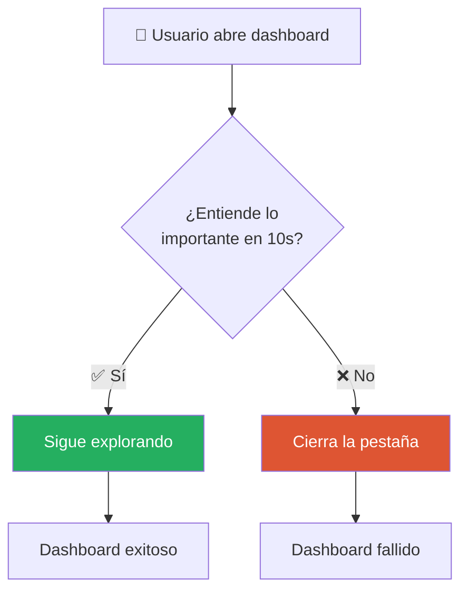
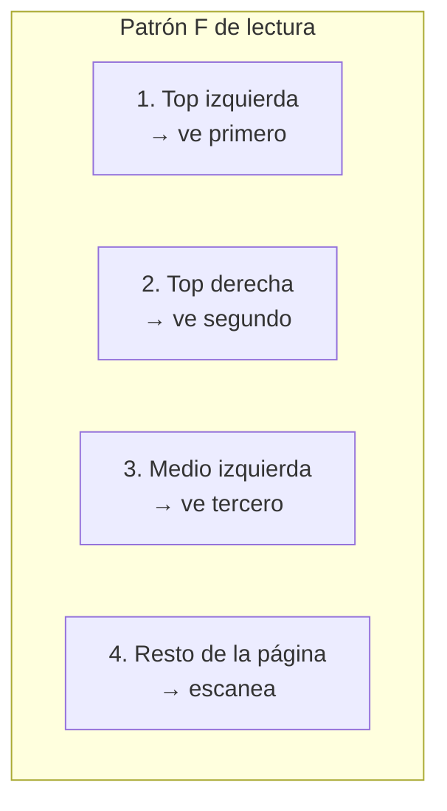
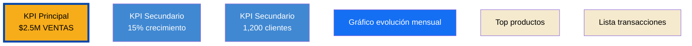
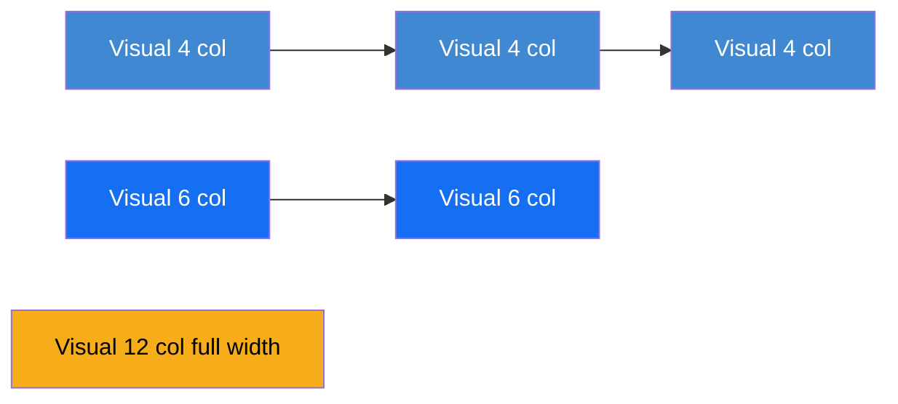
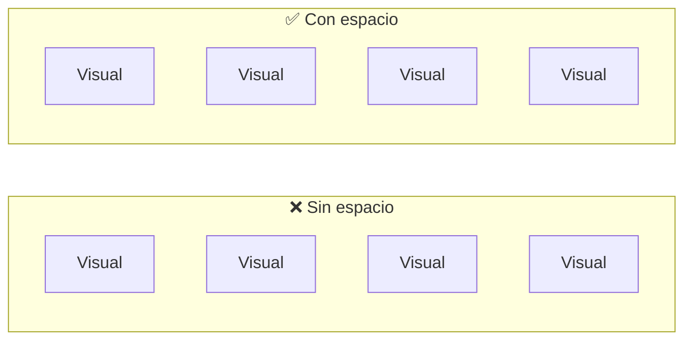

# Principios de UX para Dashboards

Cuando un ejecutivo abre tu dashboard, tiene 10 segundos para entender lo más importante. Si no lo logra, cierra la pestaña y pregunta al analista por email. Tu trabajo es diseñar para esos 10 segundos.

Esta lección te enseña los principios fundamentales de diseño visual aplicados a dashboards.

---

## El principio de los 10 segundos



**Tu dashboard se evalúa en 10 segundos.** No en 10 minutos. No en una reunión de presentación. En los primeros 10 segundos de una persona ocupada mirando su pantalla.

Diseña para eso.

---

## Jerarquía visual: guiar los ojos

Los usuarios leen un dashboard en un orden específico. Si diseñas bien, guías ese orden. Si diseñas mal, el usuario se pierde.

### Patrón F (el más común)



**Implicación práctica:**

| Zona | Qué poner |
|---|---|
| ⬆️ **Top izquierda** | KPI principal, título |
| ⬆️ **Top centro/derecha** | KPIs secundarios |
| ◀️ **Medio izquierda** | Visualización principal |
| ▶️ **Centro/derecha** | Visualizaciones de soporte |
| ⬇️ **Abajo** | Detalles, tablas, información complementaria |

[SCREENSHOT: Dashboard con zonas marcadas según patrón F]

### Regla del "más importante = más grande"

Lo que más importa debe ser **visualmente más prominente**:

- Tamaño más grande
- Color más intenso
- Posición más prominente
- Tipografía más pesada



---

## Layout y grid

Power BI tiene una cuadrícula invisible que te ayuda a alinear elementos. Úsala.

### Activar gridlines

`View → Gridlines` y `View → Snap to grid`

[SCREENSHOT: Canvas con gridlines activados]

### Regla del grid de 12 columnas

Una técnica común de diseño web: dividir el canvas en 12 columnas virtuales. Cada visual ocupa múltiplos de 12.



### Alineación consistente

Todos los visuales deben estar alineados. Márgenes iguales. Separaciones consistentes.

| ✅ Hazlo | ❌ Evítalo |
|---|---|
| Todos los visuales con el mismo padding | Márgenes aleatorios |
| Espacios iguales entre visuales | Espacios "al ojo" |
| Misma altura en filas de visuales | Alturas inconsistentes |
| Ejes alineados verticalmente | Visuales desalineados |

---

## Espacio en blanco (white space)

El espacio vacío no es desperdicio. Es aire para que los ojos descansen y el contenido respire.



### Reglas de espaciado

| Elemento | Espaciado recomendado |
|---|---|
| Entre visuales | 16-24 px |
| Padding interno del visual | 12-16 px |
| Margen de la página | 32-48 px |
| Entre secciones | 48-64 px |

> 💡 **Si dudas, deja más espacio.** El espacio en blanco hace que un dashboard se vea más profesional.

---

## La paleta de colores de CBC

CBC tiene una paleta corporativa. Úsala. No inventes colores.

### Colores principales

| Color | Hex | Uso |
|---|---|---|
| 🔵 Azul CBC principal | `#0345AA` | Títulos, acentos principales |
| 🔵 Azul CBC claro | `#4088D2` | Visualizaciones primarias |
| 🔵 Azul CBC medio | `#146FF3` | Visualizaciones secundarias |
| 🔵 Azul CBC brillante | `#5070FF` | Acentos |
| 🟡 Amarillo CBC | `#F7AD1A` | Destacados, KPIs importantes |
| 🟡 Amarillo intenso | `#FFA103` | Alertas suaves |
| 🟢 Verde CBC | `#25AF60` | Positivo, éxito, crecimiento |
| 🔴 Rojo/Naranja CBC | `#DE5533` | Negativo, alerta, caída |
| ⚪ Gris CBC | `#6B7280` | Texto secundario, bordes |
| 🟡 Crema CBC | `#F5EACE` | Fondos suaves |

### Aplicar la paleta a Power BI

**Opción 1: Manual**

Cada visual tiene opciones de formato donde puedes ingresar los códigos hex directamente.

**Opción 2: Tema personalizado (recomendado)**

1. Crear un archivo JSON con el tema de CBC
2. `View → Themes → Browse for themes`
3. Seleccionar el JSON

Ejemplo mínimo de tema JSON:

```json
{
  "name": "CBC Theme",
  "dataColors": [
    "#0345AA",
    "#4088D2",
    "#146FF3",
    "#5070FF",
    "#F7AD1A",
    "#25AF60",
    "#DE5533",
    "#6B7280"
  ],
  "background": "#FFFFFF",
  "foreground": "#0345AA",
  "tableAccent": "#F7AD1A"
}
```

Ahora todos los visuales nuevos usan automáticamente esta paleta.

> 💡 **Habla con tu lead para obtener el tema JSON oficial de CBC si existe.** Ahorra trabajo y asegura consistencia.

---

## Uso de color con intención

El color transmite información. No lo uses como decoración.

### ❌ Colorear sin propósito

```
Barra 1: azul
Barra 2: verde  
Barra 3: naranja
Barra 4: morado
```

No comunica nada. Solo añade ruido visual.

### ✅ Colorear con propósito

**Opción 1: Un color para todo**
```
Todas las barras: azul CBC (#4088D2)
```
Limpio, enfocado en los valores.

**Opción 2: Destacar lo importante**
```
Barras normales: gris claro
Barra destacada (mayor): amarillo CBC (#F7AD1A)
```
El ojo va directo a lo que importa.

**Opción 3: Semafórico**
```
Crecimiento positivo: verde (#25AF60)
Crecimiento negativo: rojo (#DE5533)
Sin cambio: gris (#6B7280)
```
El color transmite información automáticamente.

---

## Tipografía

Power BI permite cambiar fuentes. Úsalo, pero con consistencia.

### Fuentes recomendadas

| Fuente | Cuándo usarla |
|---|---|
| **Segoe UI** | Default de Power BI, siempre segura |
| **Helvetica Neue** | Estándar CBC, profesional |
| **Arial** | Respaldo universal |

> ❌ **Evitar:** Comic Sans, Times New Roman, fuentes decorativas.

### Jerarquía tipográfica

| Elemento | Tamaño | Peso |
|---|---|---|
| Título principal del reporte | 24-28 pt | Bold |
| Título de visual | 14-16 pt | Semibold |
| KPI (número grande) | 36-48 pt | Bold |
| Etiqueta de KPI | 12 pt | Regular |
| Texto de visuales | 10-11 pt | Regular |
| Texto auxiliar | 9-10 pt | Regular |

---

## Títulos descriptivos

Un buen título es la diferencia entre un visual claro y uno confuso.

### ❌ Títulos malos

- "Ventas"
- "Chart 1"
- "Datos"
- "Por categoría"

### ✅ Títulos buenos

- "Ventas totales por categoría — Últimos 12 meses"
- "Evolución mensual de clientes activos — 2024"
- "Top 10 productos por margen — Q1 2024"

**Fórmula de un buen título:**

```
[Métrica] por [Dimensión] — [Periodo o Contexto]
```

---

## Los 10 principios resumidos

### 1. Prioriza lo importante
Lo más crítico va arriba a la izquierda, más grande, más destacado.

### 2. Limita el número de visuales
5-7 visuales por página. Máximo 9. Más de eso es sobrecarga.

### 3. Alinea todo
Usa gridlines. Los visuales alineados comunican profesionalismo.

### 4. Respeta el espacio en blanco
Dashboards con espacio respiran. Los apretados agobian.

### 5. Usa la paleta corporativa
Consistencia visual = credibilidad profesional.

### 6. Color con intención
Cada color debe comunicar algo. Si no comunica, sobra.

### 7. Tipografía jerárquica
Tamaños y pesos que guían la lectura.

### 8. Títulos descriptivos
Un buen título ahorra explicaciones.

### 9. Consistencia entre páginas
Si tu reporte tiene 5 páginas, deben verse como familia. Mismo encabezado, mismo menú, mismos estilos.

### 10. Mobile-friendly (opcional pero ideal)
Power BI permite crear vistas optimizadas para móvil. Si tu dashboard se va a consumir desde el celular, hazlo.

---

## 🎯 Tareas

**Tarea 1:** Activa las gridlines en tu canvas y alinea todos los visuales existentes.

**Tarea 2:** Crea un tema JSON básico con la paleta de CBC y aplícalo.

**Tarea 3:** Revisa los títulos de todos tus visuales. Reescríbelos usando la fórmula `[Métrica] por [Dimensión] — [Periodo]`.

**Tarea 4:** Identifica qué visual debería ser el "hero" de la página. Hazlo más prominente (más grande, posición top-left).

**Tarea 5:** Aplica la regla de color con intención: elige un visual y decide si los colores actuales COMUNICAN algo o son solo decoración.

**Tarea 6:** Muéstrale tu dashboard a un colega por 10 segundos. Pregúntale qué entendió. Si no entendió lo importante, rediseña la jerarquía.

---

*Universidad Nexus — Curso de Power BI para Analistas*
