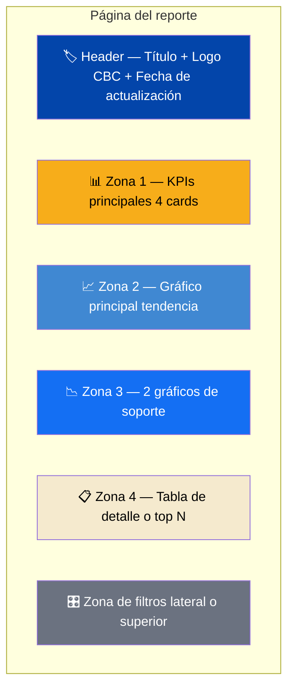

# Plantilla de Dashboard Ejecutivo

En esta lección vas a aprender a construir una **plantilla reutilizable** de dashboard ejecutivo. Una estructura que puedes copiar-pegar cada vez que te pidan un reporte nuevo.

---

## La anatomía de un dashboard ejecutivo



---

## Estructura recomendada: 5 zonas

### Zona 1: Header (arriba, ancho completo)

**Qué contiene:**
- Título del reporte (grande, claro)
- Logo de CBC (pequeño, esquina)
- Fecha de última actualización
- Nombre del analista responsable (opcional)

**Ejemplo:**

```
┌────────────────────────────────────────────────────────┐
│  [CBC]  DASHBOARD COMERCIAL — El Salvador              │
│         Última actualización: 15 Abr 2026 · Víctor V.  │
└────────────────────────────────────────────────────────┘
```

**Altura recomendada:** 80-100 px.

### Zona 2: KPIs principales (4 cards en fila)

**Qué contiene:**
- 4 KPIs principales como cards o KPI visuals
- Con indicador de variación vs periodo anterior
- Con meta cuando aplique

**Ejemplo:**

```
┌─────────────┬─────────────┬─────────────┬─────────────┐
│ VENTAS TOT  │ CRECIMIENTO │ TICKET PROM │ CLIENTES    │
│ $2.5M       │ +12.3%      │ $85         │ 1,250       │
│ ↗ vs meta   │ ↗ vs 2023   │ ↘ -3%       │ ↗ +8%       │
└─────────────┴─────────────┴─────────────┴─────────────┘
```

**Altura recomendada:** 120-150 px.

### Zona 3: Gráfico principal (ancho completo)

**Qué contiene:**
- Un solo gráfico grande que cuenta la historia principal
- Normalmente un line chart con evolución temporal
- A veces un bar chart con categorías

**Altura recomendada:** 200-250 px.

### Zona 4: Gráficos de soporte (2-3 en fila)

**Qué contienen:**
- Gráficos que complementan la historia principal
- Distribuciones, rankings, comparaciones
- Pueden ser: pie, bar, matrix, scatter

**Altura recomendada:** 200-250 px.

### Zona 5: Tabla de detalle (opcional, abajo)

**Qué contiene:**
- Tabla con datos específicos para drill-down manual
- Top N productos, top N clientes, últimas transacciones

**Altura recomendada:** 150-200 px.

---

## Medidas del canvas

Power BI ofrece varios tamaños de canvas. Para dashboards ejecutivos:

| Tamaño | Dimensiones | Cuándo |
|---|---|---|
| **16:9 Standard** | 1280 × 720 | Default, funciona en la mayoría de pantallas |
| **16:9 Large** | 1920 × 1080 | Pantallas grandes, más espacio |
| **4:3** | 1024 × 768 | Proyectores antiguos |
| **Custom** | Lo que quieras | Dashboards específicos |

**Recomendado para CBC:** 16:9 Standard (1280×720). Funciona en laptops estándar.

### Configurar el tamaño

1. Click en un espacio vacío del canvas
2. En el panel derecho: `Format → Canvas settings → Type`
3. Selecciona el tamaño

[SCREENSHOT: Canvas settings con opciones de tamaño]

---

## Plantilla visual paso a paso

### Paso 1: Background y header

1. Agrega un **Rectangle shape** que ocupe todo el header (ancho completo, ~80px alto)
2. Color de fondo: `#0345AA` (azul CBC principal)
3. Agrega un **Text box** con el título del reporte
4. Formato: blanco, 24pt, bold

[SCREENSHOT: Header del dashboard con rectángulo azul y título blanco]

### Paso 2: Fila de KPIs

1. Crea 4 **Card visuals** alineados horizontalmente
2. Cada card: mismo tamaño, misma altura
3. Usa una medida diferente en cada uno
4. Formato:
   - Número: tamaño 28pt, color negro
   - Label: tamaño 11pt, color gris (#6B7280)
   - Borde sutil gris o sin borde
   - Fondo blanco

### Paso 3: Gráfico principal

1. Line chart con `dim_fecha[mes]` en X y `[Total Ventas]` en Y
2. Ocupa el ancho completo
3. Título claro: "Evolución de ventas — Últimos 12 meses"
4. Eje Y empezando en cero
5. Color: azul CBC principal

### Paso 4: Gráficos de soporte

1. **Bar chart:** ventas por categoría (horizontal, ordenado)
2. **Pie/Donut:** distribución por país (máximo 4-5 porciones)
3. Ambos a la misma altura, lado a lado

### Paso 5: Tabla de detalle

1. Table visual con top 10 productos
2. Columnas: producto, categoría, ventas, % del total
3. Formato condicional: barras de datos en la columna de ventas

### Paso 6: Slicers

1. Slicer de **fecha** arriba del gráfico principal
2. Slicer de **categoría** (dropdown) en el header
3. Slicer de **país** (botones) en el header

[SCREENSHOT: Dashboard completo con todas las zonas pobladas]

---

## Template JSON básico

Cuando hagas un dashboard que te guste, puedes **exportar el tema** para reutilizarlo:

`View → Themes → Save current theme`

Esto genera un archivo JSON que puedes aplicar a otros reportes después.

> 💡 **Crea una plantilla .pbix vacía** con el layout que te guste, y úsala como punto de partida cada vez que hagas un reporte nuevo. Te ahorra horas.

---

## Checklist del dashboard ejecutivo

Antes de publicar, verifica:

- [ ] Header con título claro y logo CBC
- [ ] Fecha de última actualización visible
- [ ] 4 KPIs principales arriba
- [ ] 1 gráfico principal grande
- [ ] 2-3 gráficos de soporte
- [ ] Tabla de detalle (si aplica)
- [ ] Slicers bien ubicados y útiles
- [ ] Paleta de colores CBC aplicada
- [ ] Alineación perfecta (usa gridlines)
- [ ] Espaciado consistente entre visuales
- [ ] Títulos descriptivos en cada visual
- [ ] Formato de números correcto (moneda, %, enteros)
- [ ] Se entiende lo principal en 10 segundos

Si todos los checks están ✅, tu dashboard está listo para publicar.

---

## 🎯 Tareas

**Tarea 1:** Crea un archivo .pbix nuevo llamado `plantilla_ejecutiva_cbc.pbix`.

**Tarea 2:** Configura el canvas en 16:9 Standard.

**Tarea 3:** Diseña las 5 zonas siguiendo la plantilla: header, KPIs, gráfico principal, gráficos de soporte, tabla.

**Tarea 4:** Aplica el tema JSON de CBC.

**Tarea 5:** Conecta a datos reales de Databricks y llena cada zona con contenido real.

**Tarea 6:** Aplica el checklist completo.

**Tarea 7:** Guarda el archivo como plantilla para reutilizar en futuros reportes.

---

*Universidad Nexus — Curso de Power BI para Analistas*
