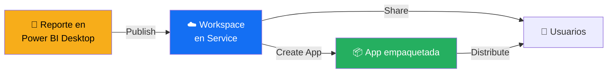
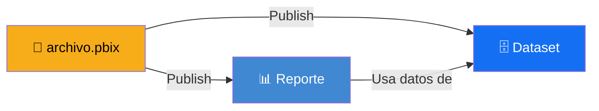
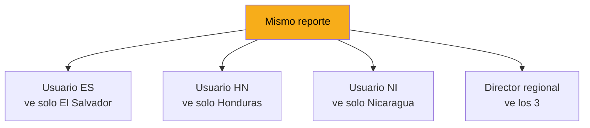

# Publicar y Compartir

Llegó el momento de que tu reporte salga de tu computadora y llegue a los ojos de tus stakeholders. Esta lección cubre el flujo completo de publicación y las opciones para compartir.

---

## El flujo completo de publicación



Los pasos son:

1. Crear/elegir un **workspace** en Power BI Service
2. **Publicar** desde Desktop al workspace
3. **Compartir** con usuarios individuales, o
4. **Empaquetar como App** para distribución más formal

---

## Workspaces: contenedores de reportes

Un **workspace** es un espacio colaborativo en Power BI Service donde vive tu contenido: reportes, dashboards, datasets, dataflows.

### Tipos de workspace

| Tipo | Para qué |
|---|---|
| **My workspace** | Tu área personal. Solo para pruebas y borradores. NO para producción. |
| **Workspace colaborativo** | El que vas a usar para cualquier cosa real. |

> ⚠️ **Regla crítica:** nunca publiques contenido productivo en "My workspace". Usa siempre un workspace colaborativo asignado al equipo.

### Crear un workspace

En Power BI Service:

1. Click en **Workspaces** en el menú lateral izquierdo
2. **Create a workspace**
3. Nombre descriptivo (ej: `CBC-Ventas-ElSalvador`)
4. Descripción breve
5. Configuración avanzada:
   - **Premium per capacity** (si tu organización tiene Premium)
   - **Contact list** (quién recibe alertas)
6. **Save**

[SCREENSHOT: Formulario de creación de workspace en Power BI Service]

### Convenciones de nombres

Usa una convención consistente para los workspaces:

| Patrón | Ejemplo |
|---|---|
| `[Empresa]-[Área]-[País]` | `CBC-Ventas-Nicaragua` |
| `[Área]-[Proyecto]` | `Comercial-RegionalDashboard` |
| `[Equipo]-[Ambiente]` | `Finanzas-PROD` |

> 💡 **Habla con tu lead.** Probablemente CBC ya tiene convenciones establecidas. Adóptalas.

### Roles en un workspace

Cuando agregas miembros a un workspace, cada uno tiene un rol:

| Rol | Permisos |
|---|---|
| **Admin** | Todo: agregar/remover miembros, eliminar workspace |
| **Member** | Crear, editar, publicar contenido |
| **Contributor** | Editar reportes existentes, no puede crear datasets |
| **Viewer** | Solo ver, no puede editar |

> 💡 **Regla:** dar el mínimo permiso necesario. Un ejecutivo que solo ve dashboards debe ser **Viewer**, no **Member**.

---

## Publicar desde Power BI Desktop

Una vez que tienes el workspace y tu reporte listo:

### Paso 1: Click en Publish

En Power BI Desktop, Ribbon → **Home → Publish**

[SCREENSHOT: Botón Publish en el Ribbon]

### Paso 2: Elegir workspace de destino

Se abre un diálogo listando los workspaces donde tienes permisos. Selecciona el apropiado.

[SCREENSHOT: Diálogo de selección de workspace]

### Paso 3: Esperar el upload

Power BI sube el archivo .pbix completo (modelo + reporte). Puede tomar segundos o minutos dependiendo del tamaño.

### Paso 4: Confirmación

Cuando termina, aparece un diálogo con un link directo al reporte en el Service. Click en el link para abrir.

[SCREENSHOT: Diálogo de confirmación con link]

### Paso 5: Verificar en el Service

Abre el workspace en el navegador. Verás dos elementos nuevos:

| Ícono | Qué es |
|---|---|
| 📊 **Report** | El reporte visible interactivo |
| 🗄️ **Dataset** | El modelo de datos detrás del reporte |

[SCREENSHOT: Workspace mostrando el reporte y el dataset recién publicados]

---

## La separación Reporte / Dataset

Cuando publicas, Power BI crea dos elementos separados:



**¿Por qué separados?**

- **Reutilización:** un dataset puede alimentar múltiples reportes
- **Mantenimiento:** actualizar el modelo una vez beneficia a todos los reportes que lo usan
- **Permisos:** puedes dar acceso al reporte sin dar acceso a los datos crudos

### Actualizar un reporte existente

Si haces cambios en tu .pbix y quieres actualizarlo en el Service:

1. En Power BI Desktop, abrir el .pbix existente
2. Hacer los cambios
3. `Publish` de nuevo
4. Power BI detecta que ya existe y pregunta si quieres reemplazar
5. Confirmar

> ⚠️ **El reemplazo sobrescribe el reporte y el dataset.** Asegúrate de que tus cambios están listos.

---

## Compartir con usuarios

Una vez publicado, necesitas dar acceso a los usuarios.

### Opción 1: Compartir directo (share)

La forma más simple. Bueno para pocos usuarios.

1. Abre el reporte en el Service
2. Click en **Share** arriba a la derecha
3. Escribe los emails de los usuarios
4. Elige si pueden compartir con otros o no
5. **Send**

[SCREENSHOT: Diálogo de Share con campos de email]

**Limitaciones:**
- ❌ Cada usuario compartido necesita licencia Pro de Power BI
- ❌ No es ideal para compartir con mucha gente
- ❌ Difícil de administrar

### Opción 2: Agregar al workspace como Viewer

Mejor que compartir directo. Bueno para equipos.

1. Workspace → Access → **Add people**
2. Agrega los emails
3. Selecciona rol: **Viewer**
4. **Add**

Los usuarios pueden ahora ver todo el contenido del workspace.

### Opción 3: Publicar como App (recomendado para producción)

La forma profesional. Bueno para distribución amplia.

**¿Qué es una App?**

Una **App** es un paquete publicable del workspace. Los usuarios finales consumen la App sin ver el workspace directamente. Es como empaquetar tu workspace en un "producto" consumible.

[SCREENSHOT: Vista de una App publicada desde el punto de vista del usuario final]

### Crear una App

1. En el workspace, click en **Create app** arriba a la derecha
2. **Setup:**
   - Nombre de la App
   - Descripción
   - Logo
   - Color del tema
3. **Navigation:**
   - Organizar las páginas y reportes
   - Crear secciones
4. **Permissions:**
   - Grupos o emails con acceso
   - Permisos específicos
5. **Publish app**

[SCREENSHOT: Wizard de creación de App con las 3 pestañas]

### Ventajas de una App

| ✅ Ventaja | Detalle |
|---|---|
| 🎨 Branded | Logo y colores personalizables |
| 👥 Escalable | Distribuir a cientos de usuarios fácilmente |
| 🔐 Control | Versión estable visible a usuarios, mientras tú sigues trabajando en el workspace |
| 📦 Profesional | Se percibe como un "producto" no un "reporte suelto" |

> 💡 **Para cualquier dashboard productivo en CBC, usa Apps.** Compartir directo es para borradores y pruebas.

---

## Row-Level Security (RLS)

A veces necesitas que distintos usuarios vean **filas distintas** del mismo reporte. Por ejemplo: cada gerente regional ve solo los datos de su región.

Esto se hace con **Row-Level Security (RLS)**.

### Cómo funciona



### Configurar RLS

#### Paso 1: Crear roles en Desktop

`Modeling → Manage roles`

1. **Create** un nuevo rol
2. Nombre: `El Salvador`
3. Definir expresión DAX de filtro para tablas:
   ```dax
   [pais] = "El Salvador"
   ```
4. **Save**

Repetir para cada región/rol necesario.

[SCREENSHOT: Manage roles mostrando configuración de rol]

#### Paso 2: Probar los roles

`Modeling → View as`

Selecciona un rol y prueba cómo se ve el reporte. Los datos deben filtrarse automáticamente.

#### Paso 3: Publicar

Publica al Service como siempre.

#### Paso 4: Asignar usuarios a roles

En Power BI Service:

1. Workspace → Dataset → **Security**
2. Para cada rol, agrega los emails de los usuarios
3. **Save**

[SCREENSHOT: Configuración de RLS en Power BI Service]

### Casos de uso típicos en CBC

- **Regional:** cada gerente ve solo su región
- **Por tienda:** cada gerente de tienda ve solo su tienda
- **Por producto:** cada product manager ve solo sus categorías

> 💡 **RLS es invisible para el usuario final.** Ellos abren el reporte y solo ven sus datos. No notan que existe un sistema de seguridad por debajo.

---

## Errores comunes al publicar

### ❌ "No tengo permisos para publicar al workspace"

**Causa:** tu rol en el workspace es Viewer o no tienes acceso.

**Solución:** habla con el admin del workspace para que te dé rol Member o Contributor.

### ❌ "Publicación falla por tamaño del archivo"

**Causa:** el .pbix supera 1 GB (límite en workspace estándar).

**Solución:**
- Reducir el tamaño del dataset (eliminar columnas, filtrar filas)
- O mover a un workspace Premium (si CBC tiene esa licencia)

### ❌ "Los usuarios ven 'No tienes acceso' al abrir"

**Causa:** faltó darles permiso al dataset además del reporte.

**Solución:** verificar permisos del dataset en el workspace.

### ❌ "El reporte se publicó pero se ve raro"

**Causa:** algunos elementos de formato no se transfieren bien (tooltips custom, íconos personalizados).

**Solución:** revisar el reporte en el Service inmediatamente después de publicar. Ajustar en Desktop y volver a publicar si es necesario.

---

## 🎯 Tareas

**Tarea 1:** Verifica que tienes acceso a Power BI Service (portal web) con tu cuenta corporativa.

**Tarea 2:** Identifica o crea un workspace apropiado para tus reportes de prueba.

**Tarea 3:** Publica el dashboard ejecutivo de la sección anterior al workspace.

**Tarea 4:** Abre el reporte en Power BI Service y verifica que se ve correcto.

**Tarea 5:** Comparte el reporte con un colega del curso usando Share directo.

**Tarea 6 (avanzado):** Configura RLS básico en un reporte con campo de país. Crea roles para El Salvador, Honduras, Nicaragua. Prueba con "View as".

**Tarea 7 (avanzado):** Crea una App a partir del workspace y publícala.

---

*Universidad Nexus — Curso de Power BI para Analistas*
