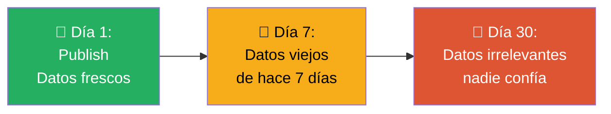
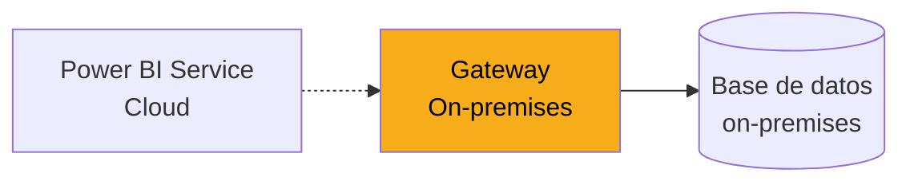
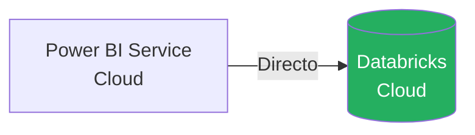
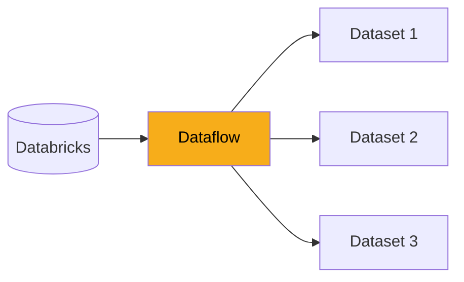
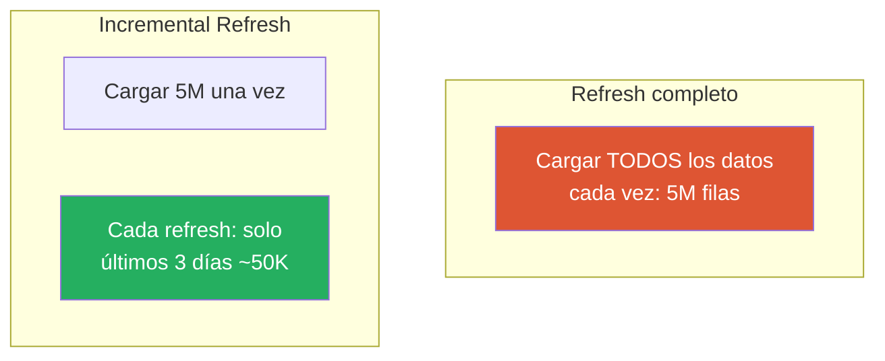

# Refresh Programado

Un reporte con datos del mes pasado es un reporte muerto. Los usuarios confían en ver los datos más recientes cada vez que abren el dashboard. Esta lección te enseña a configurar **refrescos automáticos** contra Databricks para que los datos siempre estén frescos sin que tengas que hacer nada manualmente.

---

## El problema

Cuando publicas un reporte en modo Import, los datos son una "foto" del momento en que hiciste Publish. Si no los actualizas, envejecen.



**Solución:** configurar refrescos programados. Power BI Service ejecuta periódicamente la consulta contra Databricks y actualiza el dataset automáticamente.

---

## ¿Necesitas gateway?

Para que Power BI Service pueda conectarse a tu fuente de datos para refrescar, a veces necesita un **On-premises Data Gateway**.

### Cuándo SÍ necesitas gateway



- Conectar con SQL Server on-premises
- Conectar con archivos de una carpeta local
- Conectar con APIs detrás de una VPN corporativa

### Cuándo NO necesitas gateway



- ✅ **Conectar con Databricks** (está en Azure, todo es cloud)
- ✅ Conectar con Azure SQL
- ✅ Conectar con servicios cloud (SharePoint Online, Dynamics 365, etc.)

> 💡 **Buena noticia para CBC:** como usan Databricks (cloud), NO necesitan gateway para Power BI. La conexión es directa cloud-a-cloud.

---

## Configurar credenciales del dataset

Antes de programar el refresh, Power BI Service necesita saber cómo autenticarse contra Databricks.

### Paso 1: Ir al dataset

En el Service → Workspace → encuentra el dataset del reporte → click en los tres puntos → **Settings**

[SCREENSHOT: Menú contextual del dataset con opción Settings]

### Paso 2: Data source credentials

En la pantalla de Settings, expande **Data source credentials**.

Verás la conexión a Databricks con estado probablemente en rojo o amarillo porque no tiene credenciales guardadas.

### Paso 3: Edit credentials

Click en **Edit credentials**.

Se abre un diálogo de autenticación:

| Campo | Valor |
|---|---|
| **Authentication method** | OAuth2 |
| **Privacy level** | Organizational |

Click en **Sign in**. Se abre una ventana del navegador para autenticarte con tu cuenta corporativa de CBC.

> ⚠️ **Importante:** estas son las credenciales que Power BI Service usará para ejecutar los refrescos. Si tu contraseña cambia o tu cuenta se bloquea, los refrescos van a fallar.

### Paso 4: Verificar

Después de autenticar exitosamente, el estado debe cambiar a verde:

[SCREENSHOT: Data source credentials con estado verde "Sign in successful"]

---

## Configurar el refresh programado

Una vez que las credenciales están configuradas, puedes programar los refrescos.

### Paso 1: Scheduled refresh

En la misma pantalla de Settings del dataset, expande **Scheduled refresh**.

### Paso 2: Activar

Toggle de **Keep your data up to date** → **On**

### Paso 3: Configurar

Aparecen las opciones:

| Opción | Valor recomendado |
|---|---|
| **Refresh frequency** | Daily (diario) |
| **Time zone** | (UTC-06:00) Central America |
| **Time** | Agrega horas específicas |

### Paso 4: Horarios

Power BI permite programar múltiples horarios por día:

```
Configuración típica para CBC:
- 06:00 (antes de que empiece el día laboral)
- 12:00 (al mediodía)
- 18:00 (al final del día)
```

[SCREENSHOT: Configuración de Scheduled refresh con múltiples horarios]

### Paso 5: Notificaciones de fallo

Activa **Send refresh failure notifications to**:
- ✅ Dataset owner
- ✅ These users (opcional: agregar emails de backup)

Esto asegura que si un refresh falla, alguien se entere inmediatamente.

### Paso 6: Save

Click en **Apply** para guardar la configuración.

---

## Frecuencia de refresh según la licencia

Power BI tiene límites en la frecuencia según la licencia:

| Licencia | Refrescos diarios máximos |
|---|---|
| **Pro (estándar)** | 8 refrescos por día |
| **Premium Per User** | 48 refrescos por día |
| **Premium Capacity** | 48 refrescos por día |

> 💡 **Con 8 refrescos diarios (Pro) puedes actualizar cada 3 horas durante el día.** Es más que suficiente para el 90% de los casos.

---

## Ver el historial de refrescos

Para monitorear si los refrescos están funcionando:

Dataset → **Refresh history**

[SCREENSHOT: Refresh history con lista de refrescos exitosos y fallidos]

Verás una lista de los últimos refrescos con:

| Columna | Info |
|---|---|
| **Type** | Scheduled / On demand |
| **Start** | Cuándo empezó |
| **End** | Cuándo terminó |
| **Duration** | Cuánto tardó |
| **Status** | ✅ Succeeded / ❌ Failed |
| **Message** | Detalles si falló |

---

## Diagnosticar refrescos fallidos

Los refrescos fallan. Es parte de la vida. Aquí cómo diagnosticar.

### Error 1: "Credentials expired"

**Causa:** las credenciales guardadas expiraron (OAuth2 suele expirar cada 90 días).

**Solución:** ir a Data source credentials → Edit → re-autenticarse.

### Error 2: "Table not found" o "Permission denied"

**Causa:** cambió algo en Databricks. Tabla movida, renombrada, o permisos modificados.

**Solución:**
1. Verificar que la tabla existe en Databricks
2. Verificar que tu usuario tiene permisos SELECT
3. Si algo cambió, actualizar el .pbix y volver a publicar

### Error 3: "Gateway offline" (raro para Databricks)

Si te aparece este error con Databricks, probablemente significa que el servicio de Databricks está caído. Verificar status de Azure Databricks.

### Error 4: "Timeout"

**Causa:** la consulta tarda más del límite permitido (2 horas en Pro).

**Soluciones:**
- Optimizar consultas en Databricks
- Usar agregaciones previas en Databricks
- Reducir el dataset
- Usar Incremental Refresh (avanzado)

---

## Refresh on demand

Además del refresh programado, puedes forzar un refresh manual en cualquier momento:

1. En el workspace, junto al dataset → click en el ícono de refresh
2. O desde el dataset: **Refresh now**

[SCREENSHOT: Botón Refresh now en el workspace]

**Útil para:**
- Después de una publicación nueva
- Antes de una presentación importante
- Para probar que las credenciales funcionan
- Cuando sabes que hay datos nuevos importantes

---

## Dataflows: la alternativa para casos complejos

Cuando los refrescos empiezan a complicarse (muchos reportes dependiendo de las mismas consultas), existe una herramienta llamada **Dataflows**.

### ¿Qué es un Dataflow?

Un dataflow es una **capa de ETL que vive en Power BI Service**, separada de los datasets.



**Ventajas:**
- ✅ Un solo lugar de transformación para múltiples reportes
- ✅ Los refrescos se hacen una vez en el dataflow
- ✅ Los datasets se actualizan desde el dataflow (más rápido)
- ✅ Reutilizable entre equipos

**Desventajas:**
- ❌ Complejidad adicional
- ❌ Curva de aprendizaje

> 💡 **Los dataflows son avanzados.** No los uses hasta que estés cómodo con refrescos normales. Los menciono para que sepas que existen cuando necesites escalar.

---

## Incremental Refresh

Para datasets muy grandes, Power BI tiene **Incremental Refresh**: en lugar de re-cargar toda la tabla cada vez, solo actualiza los datos nuevos.

### Cuándo usarlo

- Datasets con millones de filas históricas
- Datos que rara vez cambian hacia atrás (ventas cerradas, transacciones completas)
- Refrescos completos que tardan horas

### Cómo funciona



**Resultado:** refrescos mucho más rápidos y menos carga sobre Databricks.

### Configurar (a alto nivel)

1. En Power Query, crear parámetros `RangeStart` y `RangeEnd` (date/time)
2. Filtrar la tabla usando esos parámetros
3. En Desktop: click derecho sobre la tabla → **Incremental refresh**
4. Configurar:
   - Archivar X años de datos
   - Actualizar los últimos Y días
5. Publicar

> 💡 **Incremental refresh tiene varios pasos de configuración específicos.** Cuando lo necesites, busca la guía oficial de Microsoft. Lo menciono para que sepas que existe.

---

## Buenas prácticas de refresh

| ✅ Hazlo | ❌ Evítalo |
|---|---|
| Programa refrescos fuera del horario pico | Refrescar durante horas laborales en warehouses compartidos |
| Usa notificaciones de fallo | Dejar refrescos sin monitoreo |
| Revisa el refresh history semanalmente | Asumir que todo funciona |
| Documenta las credenciales y responsables | Configurar con tu cuenta personal sin backup |
| Prueba refresh on demand después de publicar | Publicar y olvidarte |

---

## 🎯 Tareas

**Tarea 1:** En el reporte que publicaste en la lección anterior, ve a Settings del dataset.

**Tarea 2:** Configura las credenciales de Databricks con OAuth2.

**Tarea 3:** Activa el refresh programado con al menos un horario diario (ej: 07:00 AM hora local).

**Tarea 4:** Activa las notificaciones de fallo a tu email.

**Tarea 5:** Ejecuta un refresh on demand manualmente y verifica en refresh history que fue exitoso.

**Tarea 6:** Espera al día siguiente y verifica que el refresh programado también se ejecutó correctamente.

**Tarea 7:** Documenta en un README del reporte:
- Fuente de datos
- Horario de refresh
- Responsable del dataset
- A quién contactar si falla

---

*Universidad Nexus — Curso de Power BI para Analistas*
