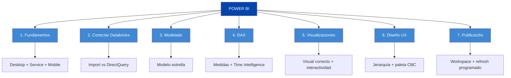
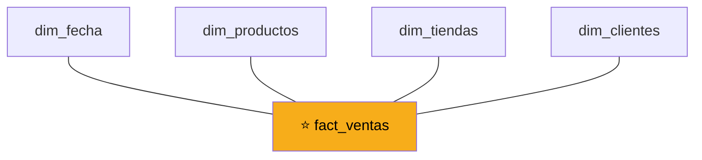
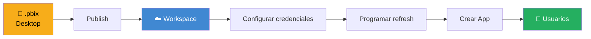
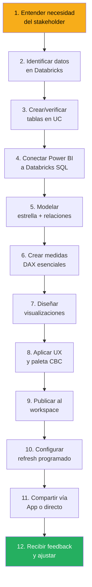

# Repaso General

Esta página es tu cheat sheet del módulo completo. Cuando estés trabajando en un reporte real y tengas dudas, abre esta página antes que Google. Tiene todo lo esencial concentrado.

---

## El mapa mental del curso



---

## 1. Conceptos base

| Concepto | En una línea |
|---|---|
| **Power BI Desktop** | Donde creas y editas reportes (Windows) |
| **Power BI Service** | Donde publicas y compartes (cloud) |
| **Reporte** | Archivo .pbix con una o más páginas interactivas |
| **Dashboard** | Vista única agregada en el Service |
| **Dataset** | El modelo de datos separado del reporte |
| **Workspace** | Contenedor colaborativo de reportes en el Service |
| **App** | Versión publicable del workspace para usuarios finales |
| **Power Query** | Editor de transformaciones antes de cargar |
| **DAX** | Lenguaje de fórmulas para medidas calculadas |
| **M** | Lenguaje detrás de Power Query |
| **VertiPaq** | Motor de compresión columnar de Power BI |

---

## 2. Decisiones clave

### Import vs DirectQuery

| Usa Import si... | Usa DirectQuery si... |
|---|---|
| Datos ≤ 1 GB comprimido | Datos > 1 GB |
| Refresco diario es suficiente | Necesitas tiempo real |
| Necesitas DAX completo | Aceptas DAX limitado |
| Primera vez (default) | Caso específico |

**Regla:** empieza con Import. Cambia a DirectQuery solo cuando tengas razón clara.

### Medida vs Columna calculada

| Usa Medida si... | Usa Columna calculada si... |
|---|---|
| Es un agregado dinámico | Es un valor por fila |
| Cambia según filtros | Es fijo para cada fila |
| Caso del 90% | Caso del 10% |

**Regla:** medidas siempre que sea posible.

### Power Query vs SQL vs DAX

| Hazlo en... | Cuando... |
|---|---|
| **Databricks SQL** | Transformaciones pesadas, limpieza, joins |
| **Power Query** | Ajustes finos, cambios de tipo, renombrado |
| **DAX** | Métricas agregadas dinámicas |

**Regla:** transforma lo máximo en la fuente, lo mínimo en Power Query, lo estrictamente agregativo en DAX.

---

## 3. Funciones DAX esenciales

### Las 15 que más vas a usar

```dax
// Agregaciones básicas
SUM(tabla[columna])
AVERAGE(tabla[columna])
COUNT(tabla[columna])
COUNTROWS(tabla)
DISTINCTCOUNT(tabla[columna])
MAX(tabla[columna])
MIN(tabla[columna])

// División segura (siempre usar DIVIDE)
DIVIDE(numerador, denominador, 0)

// Condicionales
IF(condición, valor_si, valor_no)
SWITCH(TRUE(), condición1, valor1, condición2, valor2, default)

// Contexto (la más poderosa)
CALCULATE([Medida], filtro1, filtro2)
FILTER(tabla, condición)

// Time intelligence
TOTALYTD([Medida], dim_fecha[fecha])
SAMEPERIODLASTYEAR(dim_fecha[fecha])
DATEADD(dim_fecha[fecha], -1, MONTH)
```

### Patrones comunes

**Patrón 1: Variación vs año anterior**

```dax
Variación YoY % = 
VAR Actual = [Total Ventas]
VAR Anterior = CALCULATE([Total Ventas], SAMEPERIODLASTYEAR(dim_fecha[fecha]))
RETURN DIVIDE(Actual - Anterior, Anterior, 0)
```

**Patrón 2: Promedio móvil 3 meses**

```dax
Ventas Prom 3M = 
AVERAGEX(
    DATESINPERIOD(dim_fecha[fecha], MAX(dim_fecha[fecha]), -3, MONTH),
    [Total Ventas]
)
```

**Patrón 3: Filtrar por categoría específica**

```dax
Ventas Bebidas = 
CALCULATE([Total Ventas], dim_productos[categoria] = "Bebidas")
```

**Patrón 4: YTD comparativo**

```dax
Ventas YTD = TOTALYTD([Total Ventas], dim_fecha[fecha])
Ventas YTD AA = TOTALYTD([Total Ventas], SAMEPERIODLASTYEAR(dim_fecha[fecha]))
```

---

## 4. Modelo estrella



**Reglas de oro:**

1. ✅ Una tabla de hechos en el centro
2. ✅ Dimensiones alrededor
3. ✅ Relaciones one-to-many (1:*)
4. ✅ Filtro single direction
5. ✅ Tabla de calendario propia marcada como Date table
6. ✅ Sin columnas descriptivas en la fact table
7. ✅ Los IDs conectan; las descripciones viven en las dimensiones

---

## 5. Elegir el visual correcto

| Pregunta | Visual |
|---|---|
| Un número clave | **Card / KPI** |
| Comparar categorías | **Bar chart** (ordenado) |
| Tendencia en el tiempo | **Line chart** |
| Relación entre variables | **Scatter plot** |
| Composición (parte/todo) | **Bar chart** o Pie (≤4 categorías) |
| Datos geográficos | **Map / Filled Map** |
| Detalles fila por fila | **Table / Matrix** |
| Cruzar dos dimensiones | **Matrix** (filas × columnas) |

---

## 6. Reglas de diseño visual

### Las 10 reglas de oro

1. Un visual = un mensaje
2. Ordena con propósito (por valor, no alfabéticamente)
3. Eje Y empieza en cero
4. Menos visuales, más claros
5. Color con intención
6. Títulos descriptivos: `[Métrica] por [Dimensión] — [Periodo]`
7. Formato legible de números
8. Tooltips útiles
9. Accesibilidad (contraste, tamaños)
10. Prueba con usuario real

### Paleta de CBC

```
Azul principal:   #0345AA
Azul claro:       #4088D2
Amarillo:         #F7AD1A
Verde (positivo): #25AF60
Rojo (negativo):  #DE5533
Gris (neutro):    #6B7280
```

---

## 7. Flujo de publicación



### Checklist antes de publicar

- [ ] Reporte verificado en Desktop
- [ ] Todas las medidas con formato aplicado
- [ ] Paleta CBC aplicada
- [ ] Títulos descriptivos en todos los visuales
- [ ] Jerarquía visual clara
- [ ] Workspace correcto seleccionado
- [ ] Credenciales de Databricks guardadas
- [ ] Refresh programado activo
- [ ] Notificaciones de fallo activas
- [ ] Usuarios o App configurada para compartir

---

## 8. Errores comunes y soluciones

| Error | Causa | Solución |
|---|---|---|
| DAX YoY da números raros | Tabla no marcada como Date table | Modeling → Mark as date table |
| Relación rota o mal detectada | Power BI adivinó mal | Model view → corregir manualmente |
| Visualización dice "Too many values" | Dimensión con cardinalidad muy alta | Filtrar o usar Top N |
| Refresh falla con "credentials expired" | OAuth2 expiró | Re-autenticar en Data source credentials |
| Reporte muy lento | Muchas columnas o filas innecesarias | Reducir dataset, usar agregaciones |
| Visual pie ilegible | Demasiadas categorías | Usar bar chart horizontal |
| Dashboard confuso | No hay jerarquía visual | Rediseñar siguiendo patrón F |

---

## 9. Flujo de trabajo end-to-end

El flujo completo de un reporte en CBC, de principio a fin:



---

## 10. Los 5 principios finales

### Principio 1: El dashboard sirve al negocio, no al analista

Tu trabajo no es hacer el gráfico más sofisticado. Es resolver una pregunta de negocio.

### Principio 2: Menos es más

Cada visual que agregues debe tener un propósito claro. Si dudas, quítalo.

### Principio 3: Los datos correctos importan más que el DAX elegante

Una medida simple sobre datos limpios > una medida sofisticada sobre datos sucios. Invierte en el modelo primero.

### Principio 4: La paleta y el layout son parte del mensaje

Un dashboard feo comunica "poco profesional" aunque los datos estén bien. Diseña con la paleta CBC y respeta la jerarquía visual.

### Principio 5: Publicar no es el final, es el comienzo

Un reporte publicado que nadie mira = un reporte fallido. Haz seguimiento, pide feedback, ajusta.

---

## La filosofía central del módulo

> 💡 **Un dashboard no es un reporte bonito. Es una herramienta para tomar decisiones.**
>
> Cada decisión de diseño, modelado, DAX y publicación debe servir a esa premisa. Si lo que estás haciendo no ayuda a alguien a decidir mejor, replantéalo.

---

*Universidad Nexus — Curso de Power BI para Analistas*
