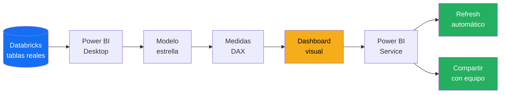
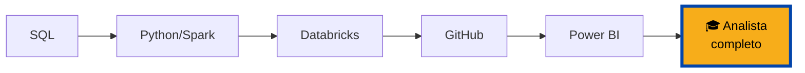

# Evaluación Final — Proyecto Integrador

Llegaste al final. Esta evaluación es tu oportunidad de demostrar que dominas **todo el flujo de trabajo de un analista de BI en CBC**: desde conectar datos de Databricks hasta publicar un dashboard ejecutivo con refrescos automáticos.

No es un examen de preguntas. Es un **proyecto real** que construyes desde cero.

---

## El caso

Eres un analista de datos en CBC. El Director Comercial Regional te pide:

> *"Necesito un dashboard ejecutivo que me permita monitorear las ventas de nuestras operaciones en El Salvador, Honduras y Nicaragua. Quiero ver los KPIs clave de un vistazo, comparar el desempeño vs el año pasado, identificar las categorías y regiones con mejor y peor rendimiento, y poder filtrar por país y rango de fechas. El dashboard debe estar disponible para todo mi equipo regional y actualizarse automáticamente cada día."*

Tu tarea: entregar ese dashboard completamente funcional.

---

## Alcance del proyecto



---

## Los 10 criterios de evaluación

Tu proyecto se evalúa sobre 10 criterios. Cada uno vale 10 puntos. Total: 100.

### ✅ Criterio 1: Conexión correcta (10 pts)

- [ ] Conectado a Databricks SQL con Azure AD
- [ ] Usando SQL Warehouse apropiado
- [ ] Tablas cargadas en modo Import
- [ ] Sin errores de credenciales
- [ ] Refresh manual funciona

### ✅ Criterio 2: Modelo estrella válido (10 pts)

- [ ] Identificas una tabla de hechos
- [ ] Tienes al menos 3 dimensiones (fecha, producto, tienda/país)
- [ ] Todas las relaciones son one-to-many con filtro single
- [ ] Tabla de calendario presente y marcada como Date table
- [ ] Modelo se ve como estrella en Model view, no como maraña

### ✅ Criterio 3: Medidas DAX esenciales (10 pts)

Debes tener al menos estas medidas creadas y formateadas:

- [ ] `Total Ventas`
- [ ] `Total Transacciones`
- [ ] `Ticket Promedio`
- [ ] `Ventas YTD`
- [ ] `Ventas AA (año anterior)`
- [ ] `Variación YoY %`
- [ ] Al menos 2 medidas adicionales propias

### ✅ Criterio 4: Medidas con contexto (CALCULATE) (10 pts)

- [ ] Al menos 3 medidas que usen `CALCULATE` con filtros
- [ ] Uso correcto de `VAR` y `RETURN` en medidas complejas
- [ ] Manejo de divisiones con `DIVIDE` (no `/`)
- [ ] Formato apropiado aplicado a cada medida

### ✅ Criterio 5: Visualizaciones correctas (10 pts)

Tu dashboard debe tener:

- [ ] 4 KPIs principales como cards (arriba)
- [ ] 1 gráfico de evolución temporal (line chart)
- [ ] 1 gráfico de comparación por categoría (bar chart horizontal)
- [ ] 1 gráfico de distribución (puede ser pie, donut, o treemap)
- [ ] 1 tabla o matrix con detalle
- [ ] Slicers funcionales (fecha y país al menos)

### ✅ Criterio 6: Interactividad (10 pts)

- [ ] Slicers afectan correctamente todos los visuales
- [ ] Cross-filtering funcional
- [ ] Al menos 1 visual con drill-down (jerarquía de fecha)
- [ ] Navegación clara si hay múltiples páginas

### ✅ Criterio 7: Diseño visual (10 pts)

- [ ] Paleta de colores CBC aplicada
- [ ] Layout alineado y con espaciado consistente
- [ ] Título del reporte visible y descriptivo
- [ ] Cada visual con título descriptivo
- [ ] Jerarquía visual clara (lo importante es más prominente)
- [ ] Tipografía consistente

### ✅ Criterio 8: Publicación (10 pts)

- [ ] Reporte publicado en un workspace (no "My workspace")
- [ ] Dataset visible y accesible
- [ ] Credenciales de Databricks configuradas
- [ ] Compartido con al menos otro colega del curso

### ✅ Criterio 9: Refresh automático (10 pts)

- [ ] Refresh programado activo
- [ ] Al menos 1 horario configurado
- [ ] Notificaciones de fallo activadas
- [ ] Refresh history muestra al menos una ejecución exitosa

### ✅ Criterio 10: Documentación (10 pts)

- [ ] Archivo `.pbix` con nombre claro
- [ ] Un documento (Word, PDF o markdown) que incluya:
  - [ ] Nombre del reporte
  - [ ] Descripción del propósito
  - [ ] Fuente de datos (tablas usadas)
  - [ ] Lista de medidas DAX creadas
  - [ ] Horario de refresh
  - [ ] Usuarios con acceso
  - [ ] Responsable (tú) y contacto

---

## Estructura recomendada del dashboard

```
┌──────────────────────────────────────────────────────────┐
│ 🏢 CBC  │ Dashboard Comercial Regional │ Actualizado: X │
├──────────────────────────────────────────────────────────┤
│ [Slicer país] [Slicer fechas] [Slicer categoría]         │
├──────────────────────────────────────────────────────────┤
│ ┌────────┐ ┌────────┐ ┌────────┐ ┌────────┐              │
│ │ VENTAS │ │ GROWTH │ │ TICKET │ │ CLIENT │              │
│ │ $2.5M  │ │ +12.3% │ │  $85   │ │  1,250 │              │
│ └────────┘ └────────┘ └────────┘ └────────┘              │
├──────────────────────────────────────────────────────────┤
│                                                           │
│         [Line chart: Evolución mensual de ventas]         │
│                                                           │
├──────────────────────────────────────────────────────────┤
│  [Bar chart: Ventas       │  [Donut: Distribución        │
│   por categoría]          │   por país]                  │
├──────────────────────────────────────────────────────────┤
│         [Matrix: Top 10 productos por ventas]            │
└──────────────────────────────────────────────────────────┘
```

---

## Proceso recomendado

### Fase 1: Preparación (1 hora)

1. Entender el caso
2. Identificar las tablas de Databricks que vas a necesitar
3. Hablar con tu lead para confirmar qué datos puedes usar
4. Crear un archivo nuevo `dashboard_comercial_cbc.pbix`

### Fase 2: Conexión y modelo (2 horas)

1. Conectar a Databricks SQL
2. Cargar las tablas necesarias (hechos + dimensiones)
3. Crear/verificar tabla de calendario
4. Configurar relaciones en Model view
5. Verificar que el modelo se ve como estrella
6. Marcar tabla de calendario como Date table

### Fase 3: Medidas DAX (2 horas)

1. Crear tabla `_Medidas` vacía
2. Crear las medidas base (Total Ventas, Transacciones, etc.)
3. Crear medidas de time intelligence (YTD, AA, variación)
4. Crear medidas con CALCULATE para filtros específicos
5. Aplicar formato a cada medida
6. Organizar en carpetas de display

### Fase 4: Visualizaciones (3 horas)

1. Diseñar el layout en papel primero
2. Configurar el canvas 16:9
3. Crear la fila de KPIs
4. Crear el gráfico principal
5. Crear gráficos de soporte
6. Crear tabla de detalle
7. Agregar slicers
8. Probar interactividad y cross-filtering

### Fase 5: Diseño y pulido (1 hora)

1. Aplicar tema JSON de CBC
2. Verificar alineación con gridlines
3. Revisar títulos descriptivos
4. Verificar formatos de números
5. Probar con Ctrl+Click en visuales (ver cross-filtering)
6. Prueba de 10 segundos: ¿se entiende lo importante al abrirlo?

### Fase 6: Publicación (1 hora)

1. Guardar el .pbix
2. Publicar al workspace apropiado
3. Abrir en Power BI Service y verificar
4. Configurar credenciales del dataset
5. Programar refresh diario
6. Activar notificaciones
7. Ejecutar refresh manual para validar

### Fase 7: Documentación (30 min)

1. Escribir el documento de documentación
2. Incluir screenshots del dashboard
3. Listar todas las medidas creadas
4. Especificar horarios y responsabilidades

### Fase 8: Compartir (15 min)

1. Compartir con al menos un colega del curso
2. Pedirle feedback honesto
3. Anotar ajustes para versión 2

**Tiempo total estimado: 10-11 horas de trabajo.** Distribúyelas como te convenga.

---

## Checklist final antes de entregar

- [ ] El archivo .pbix abre sin errores
- [ ] Todas las tablas cargan sin advertencias
- [ ] Todas las medidas calculan correctamente
- [ ] El dashboard se ve profesional (pasa el test de 10 segundos)
- [ ] Paleta de CBC aplicada consistentemente
- [ ] Publicado en workspace
- [ ] Refresh programado activo
- [ ] Documentación completa
- [ ] Compartido con al menos un colega
- [ ] Revisaste los 10 criterios de evaluación

---

## Cómo entregar

1. **Archivo .pbix** subido al repositorio o drive del curso
2. **Link al reporte en Power BI Service** enviado por email
3. **Documentación (Word/PDF/markdown)** adjunta
4. **Evidencia de refresh exitoso** (screenshot del refresh history)

---

## Más allá del módulo

Este proyecto final cierra el Pilar 6, pero también cierra **todo el programa Universidad Nexus**.



Si completaste los 6 pilares y este proyecto, tienes ahora el **toolkit completo de un analista de datos moderno en CBC**:

- ✅ Consultas SQL profesionales
- ✅ Transformaciones con Python y Spark
- ✅ Proyectos productivos en Databricks
- ✅ Colaboración con Git y GitHub
- ✅ **Dashboards que el negocio realmente usa**

Eso es lo que vinimos a construir.

---

## El mensaje final

> 💡 **Recuerda: las herramientas son herramientas. Lo que importa es el impacto que generas con ellas.**
>
> Power BI, Databricks, Spark, SQL — todos son medios para un fin. El fin es que CBC tome mejores decisiones gracias a tu trabajo. Cada reporte que publiques, cada dashboard que construyas, cada métrica que calcules, existe para servir a esa meta.
>
> Has aprendido las herramientas. Ahora te toca usarlas bien.

---

**Felicitaciones por completar Universidad Nexus.** 🎓

El siguiente paso no está en un curso. Está en los proyectos reales que vas a construir en CBC desde el lunes próximo.

Adelante.

---

*Universidad Nexus — Curso de Power BI para Analistas*
